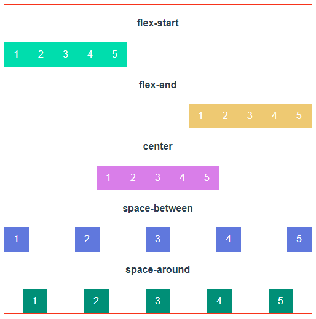
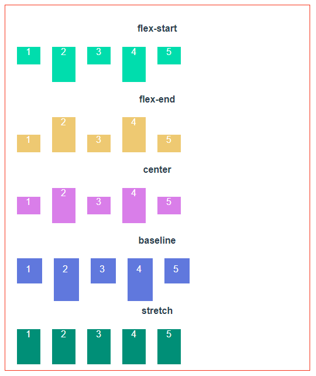
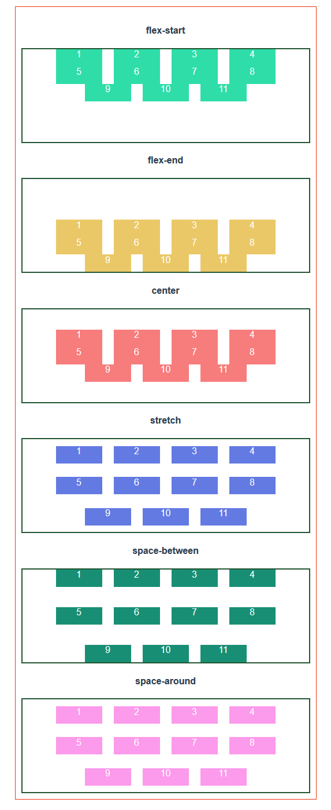
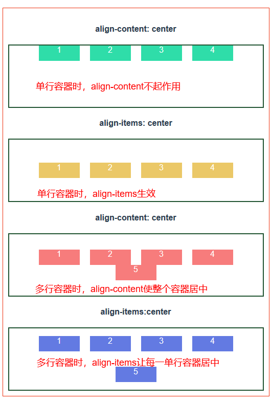
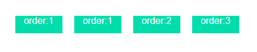
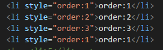

### Flex--弹性布局
***  
:warning:：设为弹性布之后，子元素的 `float`,`clear`,`vertical-align` 将失效  
 
 
1. #### 用法  
    父元素 `display:flex` 或 `display:inline-flex` (行内弹性布局）   
2. #### 容器属性 
    - **flex-direction**：定义项目的排列方式      
        `flex-direction:row|row-reverse|column|column-reverse`   
        - **row（默认值）**：主轴为水平方向，起点在左端  
        - **row-reverse**：主轴为水平方向，起点在右端  
        - **column**：主轴为垂直方向，起点在上沿   
        - **column-reverse**：主轴为垂直方向，起点在下沿    
        
    - **flex-wrap**：定义如果一条轴线排不下，如何换行。  
        `flex-wrap:wrap|nowrap|wrap-reverse`  
        - **wrap**：换行，第一行在上方  
        - **nowrap（默认值）**：不换行  
        - **wrap-reverse**：换行，第一行在下方  
        
    - **flex-flow**：属性是**flex-direction**属性和**flex-wrap**属性的简写形式，默认值为row nowrap.  
    - **justify-content**：属性定义了项目在主轴（水平方向）上的对齐方式。  
        `justifly-content:flex-start|flex-end|center|space-between|space-around`  
        - **flex-start**：左边开始对齐  
        - **flex-end**: 右边开始对齐  
        - **center**: （水平方向）居中对齐  
        - **space-between**：两端边沿对齐，项目之间的间隔都相等  
        - **space-around**：两端对齐，每个项目两侧的间隔相等。所以，项目之间的间隔比项目与边框的间隔大一倍。  
          
    - **align-items**：属性定义项目在交叉轴（垂直方向）上的对齐方式 <u>适用于**单行**的flex容器</u>    
        `align-items:flex-start|flex-end|center|baseline|stretch`  
        - **flex-start**：顶部对齐  
        - **flex-end**：底部对齐  
        - **center**：(垂直方向）居中对齐 
        - **baseline**： 第一行文字的基线对齐 
        - **stretch**（默认值）： 如果项目未设置高度或设为auto，将占满整个容器的高度。
           
    - **align-content**：属性定义了多根轴线的对齐方式。如果项目只有一根轴线，该属性不起作用。<u>只适用于**多行**的flex容器，并且当交叉轴上有多余空间使flex容器内的flex线对齐</u>  
        `align-content:flex-start|flex-end|center|stretch|space-between|space-around`  
        - **flex-start**：与交叉轴的起点对齐  
        - **flex-end**：与交叉轴的终点对齐  
        - **center**：与交叉轴的中点对齐  
        - **stretch（默认值）**：轴线占满整个交叉轴  
        - **space-between**：与交叉轴两端对齐，轴线之间的间隔平均分布  
        - **space-around**：每根轴线两侧的间隔都相等。所以，轴线之间的间隔比轴线与边框的间隔大一倍  
          
    - :small_red_triangle: **align-items与align-content的区别**
        - **align-items**：适用于**单行**flex容器  
        - **align-content**： 适用于**多行**的flex容器  
          
3. #### 项目属性  
    - **order**：定义项目的排列顺序,数值越小越靠前,默认为0  
        `order:<integer>`  
          
    - **flex-grow**：定义项目的放大比例，默认为**0**，即如果存在剩余空间，也不放大。  
        `flex-grow:<integer>`  
          
    - **flex-shrink**：定义项目的缩小比例，默认为**1**，即空间不足时，该项目将缩小（逻辑与flex-grow类似）  
        `flex-shrink:<integer>`  
    - **flex-basis**：定义了在分配多余空间之前，项目占据的主轴空间（main size）。它的默认值为auto，即项目的本来大小。    
        `flex-basis: <length> | auto`  
        应用准则：content -> width -> flex-basis (limted by max|min-width)   
        - 当指定一个flex-basis值的时候，盒子的宽度属性会被忽略
        - 如果没有设置flex-basis属性，那么flex-basis的大小就是项目的width属性的大小  
        - 如果没有设置width属性，那么flex-basis的大小就是项目内容(content)的大小  
        - min-width和max-width是flex-basis的下限和上限    
    - **flex**：属性是`flex-grow`, `flex-shrink` 和 `flex-basis`的简写，默认值为 0 1 auto。后两个属性可选（相对于使用三个单独的使用，更推荐使用flex属性）  
        `flex: none | [ <'flex-grow'> <'flex-shrink'>? || <'flex-basis'> ]`  
        该属性有两个快捷值：`auto` (1 1 auto) 和 `none` (0 0 auto)。  
    - **align-self**：属性允许单个项目有与其他项目不一样的对齐方式，可覆盖align-items属性。默认值为auto，表示继承父元素的align-items属性，如果没有父元素，则等同于stretch  
        `align-self: auto | flex-start | flex-end | center | baseline | stretch;`
        
    

