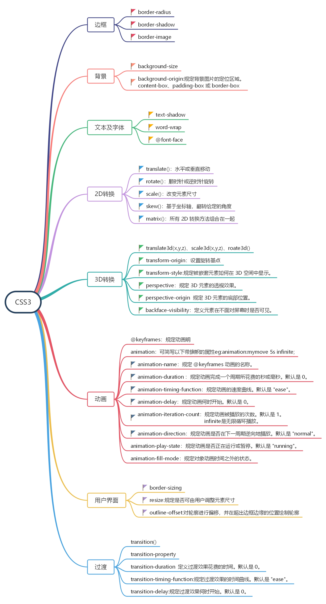

  
如果把HTML当成是建房子🏠的精钢水泥，那么CSS就是在给房子装潢🏡。  
## CSS3
 

## 题解  
### 介绍一下CSS的盒子模型
盒子模型分为两种
- W3c标准的盒子模型（标准盒模型） 
  
**标准盒模型下盒子的大小  = content + border + padding + margin**
- 第二种IE标准的盒子模型（怪异盒模型）
   
**怪异盒模型下盒子的大小=width（content + border + padding） + margin**
### CSS选择符有哪些？哪些属性可以继承？
### CSS优先级算法如何计算？
CSS 优先规则1： 最近的祖先样式比其他祖先样式优先级高。  
CSS 优先规则2："直接样式"比"祖先样式"优先级高。  
CSS 优先规则3：优先级关系：内联样式 > ID 选择器 > 类选择器 = 属性选择器 = 伪类选择器 > 标签选择器 = 伪元素选择器  

