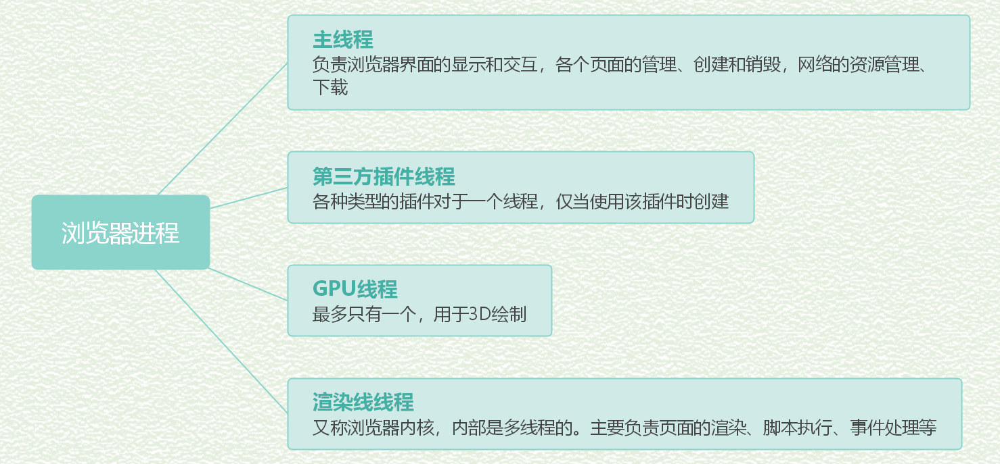
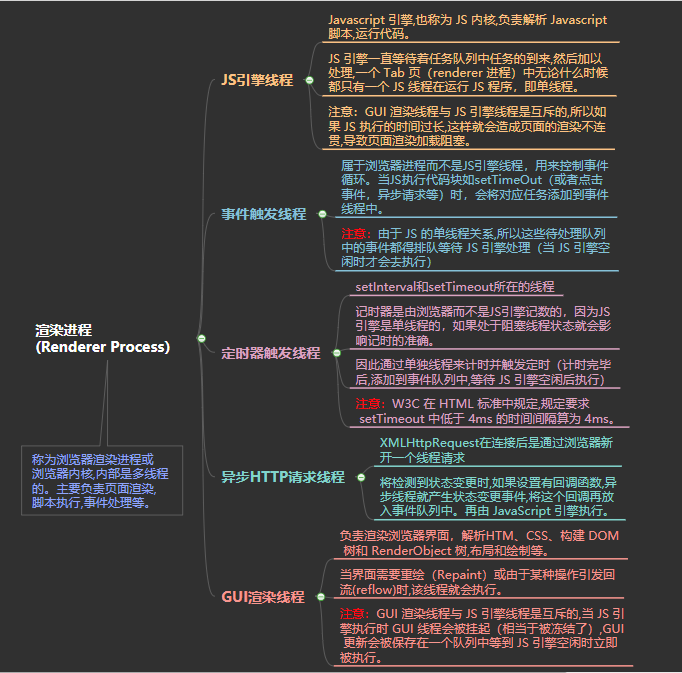

<!-- [参考文献](https://juejin.im/post/5e143104e51d45414a4715f7)   -->

对于“JS的是单线程”这一概念一直是知其然而不知其所以然，了解浏览器的渲染过程，可以更好的理解js为什么是单线程。  
### 一、进程（process）与线程（thread）  
进程（process）与线程（thread）是操作系统的基本概念  

**进程:** CPU资源分配的最小单位（是能拥有资源和独立运行的最小单位)  
**线程:** CPU调度的最小单位（是建立在进程基础上的一次程序运行的单位)  

对于操作系统来说,一个任务就是一个进程；在一个进程内部,要同时做多件事,就需要同时运行多个“子任务”,我们把进程内的这些“子任务”称为线程。 

:chestnut:：打开一个 Word（进程），同时可以进行打字（线程）、拼写检查（线程）、打印（线程）等。  

- 由于每个进程至少要做一件事,所以一个进程至少有一个线程。
- 系统会给每个进程分配独立的内存,因此进程有它独立的资源
- 同一进程内的各个线程之间共享该进程的内存空间（包括代码段,数据集,堆等） 

### 二、浏览器的多线程架构  
以 Chrome 为例,它由多个进程组成,每个进程都有自己核心的职责,它们相互配合完成浏览器的整体功能,
每个进程中又包含多个线程,一个进程内的多个线程也会协同工作,配合完成所在进程的职责。
Chrome 采用多进程架构,其顶层存在一个 Browser process 用以协调浏览器的其它进程。

  

- **优点**  
:one: 如果一个tab页面（线程）崩溃，不会影响一整个浏览器（进程）  
:two: 第三方插件崩溃也不会影响整个浏览器  
:three: 多进程可以充分利用现代 CPU 多核的优势（相当于多颗CPU, 可以同时跑多个程序）  
:four: 方便使用沙盒模型隔离插件等进程,提高浏览器的稳定性。（沙箱模型技术是浏览器和其他应用程序中保护安全的一种组件关系设计模式，“沙盒”技术的实践运用流程是：让疑似病毒文件的可疑行为在虚拟的“沙盒”里充分表演，“沙盒”会记下它的每一个动作；当疑似病毒充分暴露了其病毒属性后，“沙盒”就会执行“回滚”机制：将病毒的痕迹和动作抹去，恢复系统到正常状态。）  
- **缺点**  
:one: 系统为浏览器新开的进程分配内存、CPU 等资源,所以内存和 CPU 的资源消耗也会更大。（不过 Chrome 在内存释放方面做的不错,基本内存都是能很快释放掉给其他程序运行的。）  

### 三、浏览器的主要进程和职责  

### 四、浏览器渲染进程

  

### 五、浏览器渲染流程  
- 解析HTML文件，构建DOM树，同时浏览器主线程下载CSS文件  
- CSS文件下载完成，解析CSS文件成树形的数据结构，然后结合DOM树合并成RenderObject树  
- 绘制 RenderObject 树 （paint）,绘制页面的像素信息  
- 浏览器主进程将默认的图层和复合图层交给 GPU 进程,GPU 进程再将各个图层合成（composite）,最后显示出页面  

**DOM树与Render树**
[Dom与Render](https://blog.csdn.net/heyeqingquan/article/details/78849304)
- DOM树：是浏览器对HTML解析出来的数据结构，DOM 树上每一个节点都对应着网页里面的每一个元素，并且网页也可以通过 JavaScript 操作这棵 DOM 树，动态改变它的结构。但DOM树并不能直接用于排版和渲染  
- Render树（HTML+CSS）

### 六、题解  
#### 1. JS为什么是单线程的  
因为Javascript是处理页面中用户的交互、操作DOM树和CSS样式树来给用户呈现一份动态而丰富的交互体验和服务器逻辑的交互处理。  

如果JS是多线程的方式来操作这些 UI DOM,则可能出现 UI 操作的冲突。  
:chestnut:：假设存在两个线程同时操作一个 DOM,一个负责修改一个负责删除,那么这个时候就需要浏览器来裁决生效哪个线程的执行结果。  

#### 2. 为什么JS阻塞页面加载   
因为JS是可操作DOM的，如果在修改这些元素属性同时渲染界面（即 JavaScript 线程和 UI 线程同时运行）,那么渲染线程前后获得的元素数据就可能不一致了。  

因此为了防止渲染出现不可预期的结果,浏览器设置 GUI 渲染线程与 JavaScript 引擎为互斥的关系。  
当 JavaScript 引擎执行时 GUI 线程会被挂起,GUI 更新会被保存在一个队列中等到引擎线程空闲时立即被执行。  

因此如果 JS 执行的时间过长,这样就会造成页面的渲染不连贯,导致页面渲染加载阻塞的感觉。

#### 3. css 加载会造成阻塞吗？   
DOM和CSSOM通常是并行构建的，所以CSS加载不会阻塞DOM的解析  
但是Render Tree是依赖于DOM Tree 和 CSSOM Tree的，就是说要等到CSSOM Tree加载完成才能渲染，所以CSS的加载会阻塞页面的渲染  

由于 JavaScript 是可操纵 DOM 和 css 样式 的,如果在修改这些元素属性同时渲染界面（即 JavaScript 线程和 UI 线程同时运行）,那么渲染线程前后获得的元素数据就可能不一致了。  
所以浏览器设定JS引擎线程和GUI线程是互斥的  
因此样式表会在后面的 js 执行前先加载执行完毕，所以CSS会阻塞JS的执行

