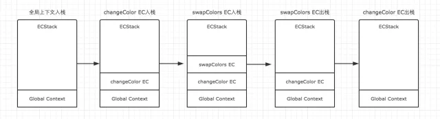
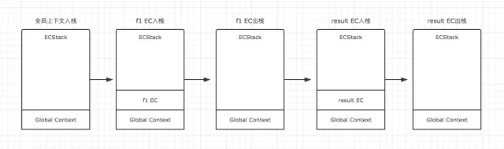
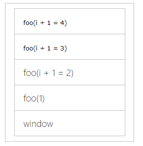

 
---
## 声明提升   
**声明提升**：变量或者函数的声明会被提升到该执行环境的顶部，如果是在全局环境声明的变量或函数，那么就会被提升到全局环境的顶部。这就意味着可以把声明语句放在执行语句后面。

🚗变量的赋值可以分为三个阶段  
- 创建变量：在内存中开辟空间
- 初始化变量：将变量初始化为undefined
- 赋值变量：给变量赋值

🚗对于let、var、function
- let 的「创建」过程被提升了，但是初始化没有提升。</br>
<font color="#425fe;">（如果在声明语句之前访问变量，会出现暂时性死区:Uncaught ReferenceError: name is not defined）</font>
- var 的「创建」和「初始化」都被提升了。<br>
<font color="#425fe;">（如果在声明语句之前读取，值为undefined）</font>
- function 的「创建」「初始化」和「赋值」都被提升了。</br>
<font color="#425fe;">（可在声明语句之前调用）</font>
  
## 执行环境以及作用域
每个函数都有自己的执行环境，每个执行环境都有一个与之关联的变量对象，保存着该环境定义的变量和函数。  
  
当代码在一个环境中执行时，会创建一个变量对象的作用域链，作用域链保证了对执行环境有权访问的所有变量和函数的有序访问。 

作用域链访问的顺序为：局部的变量对象➡外部环境的变量对象➡全局环境的变量对象  
<font color="#425fe">（作用域链只能向上搜索，不能向下搜索）</font>

某个执行环境中所有的代码执行完毕后，该环境就会被销毁，保存在其中的所有变量和函数定义也随之销毁。<font color="#425fe">（全局环境直到应用程序退出（如关闭网页）时才会被销毁）</font>

## 原型与原型链  
在讲解原型之前，先来想学习一下创建对象的几种模式。    
**1.工厂模式**
```js
function createPerson(name,age){
    var o = new Object();
    o.name=name;
    o.age=age;
    o.sayName = function(){
        alert(this.name);
    }
    return o;
}
var person1 = new createPerson("nico",18);
var person2 = new createPerson("banana",22)
```
工厂模式可以创建多个相似的对象，但没有解决对象识别的问题(即怎样知道一个对象的类型)

**2.构造函数模式**
```js
function Person(name,age){
    this.name = name;
    this.age = age;
    this.sayName = function(){
        alert(this.name)
    }
}
var person1 = new Person("nico",18);
var person2 = new Person("banana",22);
```
对比工厂模式，构造函数模式可以知道自己是由谁创建的
```js
console.log(person1 instanceof Object); //true
console.log(person1 instanceof Person); //true
console.log(person2 instanceof Object); //true
console.log(person2 instanceof Person); //true
```
但构造函数也有缺点，就是每个方法在每个实例上都要创建一次。  
如person1和person2都有一个sayName函数，但两个方法不是一个Function的实例，不同实例上的不同函数是不相等的。
```js
alert(person1.sayName()==person2.sayName())//false
```
创造两个完成同样任务的Function实例是没有必要的，还会导致了不同作用域链和标识符的解析。因此我们可以优化一下这个构造函数
```js
function Person(name,age){
    this.name = name;
    this.age = age;
    this.sayName = sayName;
}
function sayName(){
    alert(this.name)
}
var person1 = new Person("nico",18);
var person2 = new Person("banana",22);
alert(person1.sayName()==person2.sayName())//true
```
我们把sayName()定义在构造函数外部，这样person1,person2就共享了全局环境定义的sayName函数的。但是问题又来了，全局环境中定义的函数只能被某个函数调用，而且要是有很多个方法怎么办，那不就要定义很多方法了。那我们再来看看原型模式。

**3.原型模式**  
我们在创建的每一个函数都会创建一个prototype原型属性，这个属性是一个指针，指向一个原型对象。原型对象prototype里面有constructor，指向构造函数本身。  
  
先弄懂两个东西  
- prototype:构造函数都有的属性，表示被实例化出来的对象的原型是谁
- _proto_:所有JavaScript对象（包括函数）都有的属性，表示某个对象的原型 
```js
//首先要明白两个准则
Person.prototype.constructor == Person 
// **准则1：原型对象（即Person.prototype）的constructor指向构造函数本身**
person1.__proto__ == Person.prototype 
// **准则2：实例（即person1）的__proto__和原型属性指向同一个地方**
```
👉再来看看这张经典图  

```js
// 从上方 function Foo() 开始分析这一张经典之图
function Foo(){};
let f1 = new Foo();
let f2 = new Foo();
f1._proto_ = Foo.prototype;
f2._proto_ = Foo.prototype;
Foo.prototype._proto_ = Object.prototype
Object.prototype._proto_ = null//原型链到此结束

Foo.prototype.constructor = Foo
Foo._proto_ = Function.prototype
Function.prototype._proto_ = Object.prototype
Object.prototype._proto_ = null//原型链到此结束
// 从中间 Function Object()开始分析这一张经典之图


// 从下方 Function Function()开始分析这一张经典之图

```

👉来看看原型模式如何创建对象
```js
function Person(){

}
Person.prototype.name = "nico";
Person.prototype.age = 18;
Person.prototype.sayName = function(){
    alert(this.name);
}
var person1 = new Person();
person1.sayName()//nico
var person2 = new Person();
person2.sayName()//nico
alert(person1.sayName()==person2.sayName())//true
``` 

**4.组合使用构造模式与原型模式**
```js
function Person(name,age){
    this.name = name;
    this.age = age;
}
Person.prototype = function(){
    constructor:Person,
    sayName:function(){
        alert(this.name);
    }
}
```


原型与原型层层相链接的过程即为原型链。


## 闭包  
闭包：就是有权访问另一个函数作用域中变量的函数。  
常见方式就是在一个函数内部创建另一个函数，此时内部函数就是一个闭包函数，他可以访问外部函数中的变量。  
为什么可以访问：因为内部函数的作用域链中包含了外部函数的作用域。

当函数被调用时，会创建一个执行环境和相应的作用域链，然后初始化函数的活动对象。

正常情况下，函数执行完毕后，局部活动对象就会被销毁，内存中仅保存了全局活动对象。  
但对于闭包来说，当外部函数执行完毕时，该外部函数的作用域链就会被销毁，但是因为内部函数的作用域链还在引用外部函数的活动对象，所以外部函数的活动地对象依然保留在内存中，直到闭包函数被销毁。  

- 缺点：因为闭包会包含外部函数的作用域，所以占用了较多的内存空间。
- 优点：可以让一个变量长期储存在内存中，避免全局变量的污染，可以存在私有成员。

闭包与变量：闭包只能取得包含函数中任何变量的最后一个值  
```js
function createFun(){
    var res=new Array();
    for(var i=0;i<5;i++){
        res[i]=function(){
            return i;
        };
        res[i];
    }
    return res;
}
var fun=createFun();
for(var i=0;i<fun.length;i++){
document.write(fun[i]() + "<br />");
}//以上输出全部是i的最后一次的值（5）
```
如上面的栗子，输出全部是i的最后一次的值——5  
解析：因为每个函数都保存了createFun函数的活动对象，所以他们引用的都是同一个i,当createFun函数返回后，变量i的值是10  
解决：但有时候，我们需要达到循环输出不一样的值，那要怎么做呢？——创建另一个匿名函数
```js
function createFun(){
    var res=new Array();
    for(var i=0;i<5;i++){
        res[i]=function(num){
            return function(){
                return num;
            }
        }(i)//立即执行此匿名函数
    }
    return res;
}
var fun=createFun();
for(var i=0;i<fun.length;i++){
document.write(fun[i]() + "<br />");
}
``` 

## 执行上下文  
执行上下文可以理解为当前代码的执行环境，它会形成一个作用域。执行环境：全局环境、局部环境、eval    

因此在一个JavaScript程序中，必定会产生多个执行上下文。

JavaScript引擎会以堆栈的方式来处理它们，这个堆栈，我们称其为函数调用栈(call stack)。栈底永远都是全局（环境）上下文，而栈顶就是当前正在执行的上下文。 

当代码在执行过程中，遇到以上三种情况，都会生成一个执行上下文，放入栈中，而处于栈顶的上下文执行完毕之后，就会自动出栈。  

🌰我们来看个栗子：
```js
var color = 'blue';
function changeColor() {
    var anotherColor = 'red';
    function swapColors() {
        var tempColor = anotherColor;
        anotherColor = color;
        color = tempColor;
    }
    swapColors();
}
changeColor();
```
我们用ECStack来表示处理执行上下文组的堆栈。  
- 全局上下文入栈  
- changeColor EC入栈  
- swapColors EC入栈
- swapColors EC出栈
- changeColor EC出栈
  

通常情况下，全局上下文在浏览器窗口关闭后出栈。

<u>注意：函数中，遇到return能直接终止可执行代码的执行，因此会直接将当前上下文弹出栈。</u>

🌰再来看个栗子：
```js
function f1(){
    var n=18;
    function f2(){
        alert(n);
    }
    return f2;
}
var result=f1();
result(); // 18
```
因为f1中的函数f2在f1的可执行代码中，并没有被调用执行，因此执行f1时，f2不会创建新的上下文，而直到result执行时，才创建了一个新的。具体演变过程如下。  
  

🌰再来看个栗子：
```js
console.log('global begin: ' + i); // ?
var i = 1;
foo(1);
function foo(i) {
    if (i == 4) {
        return;
    }
    console.log('foo() begin: ' + i); // ?
    foo(i+1);
    console.log('foo() end: ' + i); // ?
}
console.log('global end: ' + i); // ?
```

这个栗子的堆栈如图：  
  

所以这个栗子的输出结果依次为：undefined、1、2、3、3、2、1、1
<!-- 函数  
原型链  
闭包  
类 
语法糖  
同步异步  
ajax  
渣渣 -->


