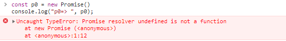
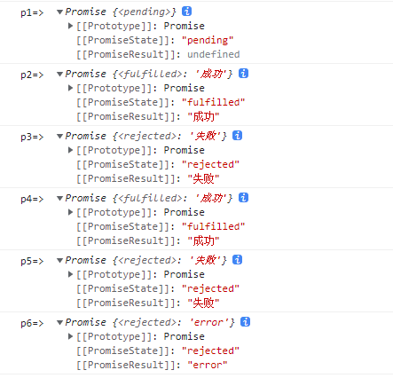

## Promise

- 理解 promise 基础概念
- 理解 promise 常用 api
- 手写 promise

### 理解 Promise

#### 含义

<font style="color:#ff502c; background-color: #fff5f5;">Promise</font> 是一个<b>异步编程</b>的解决方案，比传统的异步解决方案: <b>回调函数</b>和<b>事件</b>更合理、更强大。  
`async` 和 `await` 的底层都是使用了 `promise`

<font style="color:#ff502c; background-color: #fff5f5;">Promise</font> 对象代表一个异步操作，它有三种状态：

- <b>pending</b>（进行中）: 初始状态或者处理中
- <b>fulfilled</b>（已成功）：表示成功完成
- <b>rejected</b>（已失败）：表示失败

为了更好的理解`promise`的运行过程，看看下面一段代码，并思考下它们都会输出什么

```js
const p0 = new Promise();
const p1 = new Promise(() => {});
const p2 = new Promise((resolve, reject) => {
  resolve("成功");
});
const p3 = new Promise((resolve, reject) => {
  reject("失败");
});
const p4 = new Promise((resolve, reject) => {
  resolve("成功");
  reject("失败");
});
const p5 = new Promise((resolve, reject) => {
  reject("失败");
  resolve("成功");
});
const p6 = new Promise((resolve, reject) => {
  throw "error";
});
console.log("p0=> ", p0);
console.log("p1=> ", p1);
console.log("p2=> ", p2);
console.log("p3=> ", p3);
console.log("p4=> ", p4);
console.log("p5=> ", p5);
console.log("p6=> ", p6);
```

<details><summary><b>点击查看结果</b></summary>




</details>

可以得出：

- `promise`必须给`Promise`对象传入一个执行函数，否则将会报错
- `promise`的初始状态为 <b>pending</b>, 如果没有处理则一直为`pending`
- 执行 <b>resolve</b> 之后，`promise`的状态会变成 <b>fulfilled</b>
- 执行 <b>reject</b> 之后，`promise`的状态会变成 <b>reject</b>
- `promise`的状态改变有两种情况 <b>pending => resolve</b> 和 <b>pending => reject</b>，并且他以第一次改变的结果为准，一旦改变就永久不变
- `promise`中有 <b>throw</b> 的话，相当于执行了 <b>reject</b>

再来看看`promise.then()`是什么

```js
const p0 = new Promise(() => {});
console.log("p0.then() =>", p0.then());
console.log("-------------------------------------------------");

const p1 = new Promise((resolve, reject) => {
  console.log("Here is p1");
});
console.log("p1.then() =>", p1.then());
console.log("-------------------------------------------------");

const p2 = new Promise((resolve, reject) => {
  console.log("Here is p2");
  resolve("成功");
});
console.log("p2.then() =>", p2.then());
console.log("-------------------------------------------------");

const p3 = new Promise((resolve, reject) => {
  console.log("Here is p3");
  reject("失败");
});
console.log("p3.then() =>", p3.then());
console.log("-------------------------------------------------");

const p4 = new Promise((resolve, reject) => {
  console.log("Here is p4");
});
p4.then(() => {
  console.log("Here is p4.then()");
});
console.log("p4.then() =>", p4.then());
console.log("-------------------------------------------------");

const p5 = new Promise((resolve, reject) => {
  console.log("Here is p5");
  resolve("成功");
});
p5.then(() => {
  console.log("Here is p5.then()");
});
console.log("p5.then() =>", p5.then());
console.log("-------------------------------------------------");

const p6 = new Promise((resolve, reject) => {
  console.log("Here is p6");
  reject("失败");
});
p6.then(
  () => {
    console.log("Here is p6.then().onFulfilled");
  },
  () => {
    console.log("Here is p6.then().onRejected");
  }
);
console.log("p6.then() =>", p6.then());
console.log("-------------------------------------------------");

const p7 = new Promise((resolve, reject) => {
  console.log("Here is p7");
  resolve("成功");
});
p7.then(
  () => {
    console.log("Here is p7.then().onFulfilled");
    throw "error";
  },
  () => {
    console.log("Here is p7.then().onRejected");
  }
).then(
  () => {
    console.log("Here is 2.0-p7.then().onFulfilled");
  },
  () => {
    console.log("Here is 2.0-p7.then().onRejected");
  }
);
console.log("p7.then() =>", p7.then());
console.log("-------------------------------------------------");

const p8 = new Promise((resolve, reject) => {
  console.log("Here is p8");
  reject("失败");
});
p8.then(
  () => {
    console.log("Here is p8.then().onFulfilled");
  },
  () => {
    console.log("Here is p8.then().onRejected");
    throw "error";
  }
).then(
  () => {
    console.log("Here is 2.0-p8.then().onFulfilled");
  },
  () => {
    console.log("Here is 2.0-p8.then().onRejected");
  }
);
console.log("p8.then() =>", p8.then());
console.log("-------------------------------------------------");
```

<details><summary><b>点击查看结果</b></summary>


</details>

可以得出：

- 不管是否执行`resolve`和`reject`，都能打印出`promise.then()`，返回该`promise`本身
- 因为`promise.then()`返回的也是一个`promise`对象，所以可以添加多个`then()`链试调用，他们按添加顺序执行
- `promise.then()`就是一个回调函数，用户可以自定义函数内容, 它可以传入两个参数，分别指定`resolved`状态和`rejected`状态的回调函数，即让它成功之后做什么失败之后做什么
- `pending`状态下的`promise`不会执行回调函数`then()`，只有变为`resolved`和`reject`状态之后，通过`then()` 添加的回调函数才会被调用
