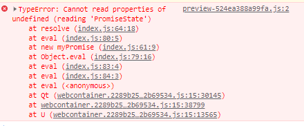
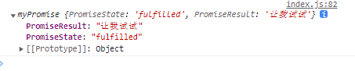

## Promise

- 理解 promise 基础概念
- 理解 promise 常用 api
- 手写 promise

### 理解 Promise

#### 含义

<font style="color:#ff502c; background-color: #fff5f5;">Promise</font> 是一个<b>异步编程</b>的解决方案，比传统的异步解决方案: <b>回调函数</b>和<b>事件</b>更合理、更强大。  
`async` 和 `await` 的底层都是使用了 `promise`

<font style="color:#ff502c; background-color: #fff5f5;">Promise</font> 对象代表一个异步操作，它有三种状态：

- <b>pending</b>（进行中）: 初始状态或者处理中
- <b>fulfilled</b>（已成功）：表示成功完成
- <b>rejected</b>（已失败）：表示失败

为了更好的理解`promise`的运行过程，看看下面一段代码，并思考下它们都会输出什么

```js
const p0 = new Promise();
const p1 = new Promise(() => {});
const p2 = new Promise((resolve, reject) => {
  resolve("成功");
});
const p3 = new Promise((resolve, reject) => {
  reject("失败");
});
const p4 = new Promise((resolve, reject) => {
  resolve("成功");
  reject("失败");
});
const p5 = new Promise((resolve, reject) => {
  reject("失败");
  resolve("成功");
});
const p6 = new Promise((resolve, reject) => {
  throw "error";
});
console.log("p0=> ", p0);
console.log("p1=> ", p1);
console.log("p2=> ", p2);
console.log("p3=> ", p3);
console.log("p4=> ", p4);
console.log("p5=> ", p5);
console.log("p6=> ", p6);
```

<details><summary><b>点击查看结果</b></summary>


</details>

可以得出：

- `promise`必须给`Promise`对象传入一个执行函数，否则将会报错
- `promise`的初始状态为 <b>pending</b>, 如果没有处理则一直为`pending`
- 执行 <b>resolve</b> 之后，`promise`的状态会变成 <b>fulfilled</b>
- 执行 <b>reject</b> 之后，`promise`的状态会变成 <b>reject</b>
- `promise`的状态改变有两种情况 <b>pending => resolve</b> 和 <b>pending => reject</b>，并且他以第一次改变的结果为准，一旦改变就<b>永久不变</b>
- `promise`中有 <b>throw</b> 的话，相当于执行了 <b>reject</b>

再来看看`promise.then()`是什么

```js
const p0 = new Promise(() => {});
console.log("p0.then() =>", p0.then());
console.log("-------------------------------------------------");

const p1 = new Promise((resolve, reject) => {
  console.log("Here is p1");
});
console.log("p1.then() =>", p1.then());
console.log("-------------------------------------------------");

const p2 = new Promise((resolve, reject) => {
  console.log("Here is p2");
  resolve("成功");
});
console.log("p2.then() =>", p2.then());
console.log("-------------------------------------------------");

const p3 = new Promise((resolve, reject) => {
  console.log("Here is p3");
  reject("失败");
});
console.log("p3.then() =>", p3.then());
console.log("-------------------------------------------------");

const p4 = new Promise((resolve, reject) => {
  console.log("Here is p4");
});
p4.then(() => {
  console.log("Here is p4.then()");
});
console.log("p4.then() =>", p4.then());
console.log("-------------------------------------------------");

const p5 = new Promise((resolve, reject) => {
  console.log("Here is p5");
  resolve("成功");
});
p5.then(() => {
  console.log("Here is p5.then()");
});
console.log("p5.then() =>", p5.then());
console.log("-------------------------------------------------");

const p6 = new Promise((resolve, reject) => {
  console.log("Here is p6");
  reject("失败");
});
p6.then(
  () => {
    console.log("Here is p6.then().onFulfilled");
  },
  () => {
    console.log("Here is p6.then().onRejected");
  }
);
console.log("p6.then() =>", p6.then());
console.log("-------------------------------------------------");

const p7 = new Promise((resolve, reject) => {
  console.log("Here is p7");
  resolve("成功");
});
p7.then(
  () => {
    console.log("Here is p7.then().onFulfilled");
    throw "error";
  },
  () => {
    console.log("Here is p7.then().onRejected");
  }
).then(
  () => {
    console.log("Here is 2.0-p7.then().onFulfilled");
  },
  () => {
    console.log("Here is 2.0-p7.then().onRejected");
  }
);
console.log("p7.then() =>", p7.then());
console.log("-------------------------------------------------");

const p8 = new Promise((resolve, reject) => {
  console.log("Here is p8");
  reject("失败");
});
p8.then(
  () => {
    console.log("Here is p8.then().onFulfilled");
  },
  () => {
    console.log("Here is p8.then().onRejected");
    throw "error";
  }
).then(
  () => {
    console.log("Here is 2.0-p8.then().onFulfilled");
  },
  () => {
    console.log("Here is 2.0-p8.then().onRejected");
  }
);
console.log("p8.then() =>", p8.then());
console.log("-------------------------------------------------");
```

<details><summary><b>点击查看结果</b></summary>


</details>

可以得出：

- 不管是否执行`resolve`和`reject`，都能打印出`promise.then()`，返回一个新的 Promise 实例（注意，不是原来那个 Promise 实例）
- 因为`promise.then()`返回的也是一个`promise`对象，所以可以添加多个`then()`链试调用，他们按添加顺序执行
- `promise.then()`就是一个回调函数，用户可以自定义函数内容, 它可以传入两个参数，分别指定`resolved`状态和`rejected`状态的回调函数，即让它成功之后做什么失败之后做什么
- `pending`状态下的`promise`不会执行回调函数`then()`，只有变为`resolved`和`reject`状态之后，通过`then()` 添加的回调函数才会被调用

### 基本用法

Promise 对象本身就是一个构造函数，可以直接用来生成 promise 实例

```js
const promise =  new Promise((resolve, reject) => {
  if (/* 异步操作成功 */) {
    resolve()
  } else {
    reject()
  }
})
```

- Promise 构造函数接受一个函数作为参数，该函数有两个参数：resolve、reject
- resolve：将 pending 转为 fulfilled, 在异步操作成功时调用
- reject：将 pending 转为 rejected, 在异步操作失败时调用

```js
promise.then(
  () => {
    // handle resolved
  },
  () => {
    // handle rejected
  }
);
```

- Promise 实例生成以后，then 方法可以接受两个回调函数作为参数，可以用于分别指定异步操作成功和失败的回调函数
- 这两个函数都是可选的，不一定要提供

resolve 函数的参数除了正常的值以外，还可能是另一个 Promise 实例，比如像下面这样

```js
const p1 = new Promise((resolve, reject) => {});
const p2 = new Promise((resolve, reject) => {
  resolve(p1);
});
```

- p1、p2 都是 promise 的实例,p1 作为 p2 resolve 的参数，即一个异步操作的结果(p2)是返回另一个异步操作(p1)
- 只有 p1 状态改变了,p2 的 resolve 才会执行，如果 p1 的状态是 pending，那么 p2 的回调函数就会等待 p1 的状态改变

调用 resolve 或 reject 并不会终结 Promise 的参数函数的执行

```js
const promise = new Promise((resolve, reject) => {
  resolve(1);
  console.log(2);
}).then((r) => {
  console.log(r);
});
```

- 执行完`resolve(1)`之后，还是会执行`console.log(2)`,并且会首先打印出来

### Promise.prototype.then()

- `then`方法是定义在原型对象 `Promise.prototype` 上面的方法
- `then` 方法的第一个参数是 `resolved` 状态的回调函数，第二个参数是 `rejected` 状态的回调函数，它们都是可选的
- `then` 方法返回的是一个<b>新的</b> `Promise` 实例（注意，不是原来那个 `Promise` 实例），因此可以采用<b>链式写法</b>，即 `then` 方法后面再调用另一个 `then` 方法
- 采用链式的 `then`，可以指定一组按照次序调用的回调函数。这时，前一个回调函数，有可能返回的还是一个 `Promise` 对象（即有异步操作），这时后一个回调函数，就会等待该 `Promise` 对象的状态发生变化，才会被调用

### Promise.prototype.catch()

- 是`.then(undefined, reject)`或`.then(null, reject)`的别名，用于指定发生错误时的回调函数
- 当`promise`状态变为`reject`，就会调用`catch`指定的回调函数
- 在`then`方法指定的回调函数中，如果运行中抛出错误，也会被`catch`方法捕获
- `reject()`方法的作用，等同于抛出错误
- 如果`Promise`状态已经变成`resolved`，再抛出错误是无效,因为`promise`的状态一旦改变了就不会再变了

```js
const promise = new Promise(function (resolve, reject) {
  resolve("ok");
  throw new Error("test");
  // 在resolve语句后面，再抛出错误，不会被捕获
});
promise
  .then(function (value) {
    console.log(value);
  })
  .catch(function (error) {
    console.log(error);
  });
```

- `Promise` 对象的错误具有<b>冒泡</b>性质，会一直向后传递，直到被捕获为止

```js
getJSON("/post/1.json")
  .then(function (post) {
    return getJSON(post.commentURL);
  })
  .then(function (comments) {
    // some code
  })
  .catch(function (error) {
    // 处理前面三个Promise产生的错误
  });
// 一共有三个 Promise 对象：一个由getJSON()产生，两个由then()产生
// 它们之中任何一个抛出的错误，都会被最后一个catch()捕获
```

- 一般来说，不要在`then()`方法里面定义 `Reject` 状态的回调函数（即 then 的第二个参数），总是使用`catch`方法。

```js
// bad
promise.then(
  function (data) {
    // success
  },
  function (err) {
    // error
  }
);

// good
promise
  .then(function (data) {
    //cb
    // success
  })
  .catch(function (err) {
    // error
    // 可以捕获前面then方法执行中的错误，也更接近同步的写法（try/catch）
  });
```

- 跟传统的`try/catch`代码块不同的是，如果没有使用`catch()`方法指定错误处理的回调函数，`Promise` 对象抛出的错误不会传递到外层代码，即不会有任何反应。通俗的说法就是“Promise 会吃掉错误”
- catch()方法返回的还是一个 Promise 对象，因此后面还可以接着调用 then()方法。如果没有报错，则会跳过 catch()方法。

### Promise.prototype.finally()

- 用于指定不管 `Promise` 对象最后状态如何，都会执行的操作
- `finally`方法的回调函数不接受任何参数，这意味着没有办法知道，前面的 `Promise` 状态到底是 `fulfilled` 还是 `rejected`
- `finally`本质上是`then`方法的特例

```js
promise.finally(() => {});
// 等价于
promise.then(
  (result) => {
    return result;
  },
  (error) => {
    throw error;
  }
);
```

- `finally` 方法总是会返回原来的值

```js
// resolve 的值是 undefined
Promise.resolve(2).then(
  () => {},
  () => {}
);

// resolve 的值是 2
Promise.resolve(2).finally(() => {});

// reject 的值是 undefined
Promise.reject(3).then(
  () => {},
  () => {}
);

// reject 的值是 3
Promise.reject(3).finally(() => {});
```

### Promise.all()

- `Promise.all()`方法用于将多个 `Promise` 实例，包装成一个新的 `Promise` 实例
- `Promise.all()`方法接受一个数组作为参数, 也可以不是数组，但必须具有 Iterator 接口，且返回的每个成员都是 Promise 实例。

```js
const p = Promise.all([p1, p2, p3]);
```

- 只有 p1、p2、p3 的状态都变成 fulfilled，p 的状态才会变成 fulfilled，此时 p1、p2、p3 的返回值组成一个数组，传递给 p 的回调函数。
- 只要 p1、p2、p3 之中有一个被 rejected，p 的状态就变成 rejected，此时第一个被 reject 的实例的返回值，会传递给 p 的回调函数。

### Promise.race()

- `Promise.race()`方法的参数与`Promise.all()`方法一样
- 只要 p1、p2、p3 之中有一个实例率先改变状态，p 的状态就跟着改变。那个率先改变的 `Promise` 实例的返回值，就传递给 p 的回调函数

### Promise.allSettled()

有时候我们希望等一组异步操作都结束了，不管是每一个操作是成功还是失败，再进行下一步操作，但是现有的 Promise 很难达到这样的要求

- Promise.all()方法只适合所以异步操作都成功的情况，一旦有一个操作失败了，就会返回结果，不管后面的操作是否完成
- Promise.allSettled()方法接受一个数组作为参数，数组的每个成员都是一个 Promise 对象，并返回一个新的 Promise 对象
- 只有等到参数数组的所有 Promise 对象都发生状态变更（不管是 fulfilled 还是 rejected），返回的 Promise 对象才会发生状态变更

```js
const resolved = Promise.resolve(42);
const rejected = Promise.reject(-1);

const allSettledPromise = Promise.allSettled([resolved, rejected]);

allSettledPromise.then(function (results) {
  console.log(results);
});
// [
//    { status: 'fulfilled', value: 42 },
//    { status: 'rejected', reason: -1 }
// ]
```

- Promise.allSettled()的返回值 allSettledPromise，状态只可能变成 fulfilled
- 它的回调函数接收到的参数是数组 results。results 的每个成员是一个对象，对象的格式是固定的，对应异步操作的结果

### Promise.any()

- 该方法接受一组 Promise 实例作为参数
- 只要参数实例有一个变成 fulfilled 状态，包装实例就会变成 fulfilled 状态
- 所以的参数实例都变成 reject 状态，包装实例就会变成 rejected 状态
- 和 Promise.race()的区别是，有一个参数实例变成 reject，不会立刻结束，必须等到所有参数 Promise 变成 rejected 状态才会结束
- Promise.any()抛出的错误，不是一个一般的 Error 错误对象，而是一个 AggregateError 实例。它相当于一个数组，每个成员对应一个被 rejected 的操作所抛出的错误

```js
var resolved = Promise.resolve(42);
var rejected = Promise.reject(-1);
var alsoRejected = Promise.reject(Infinity);

Promise.any([resolved, rejected, alsoRejected]).then(function (result) {
  console.log(result); // 42
});

Promise.any([rejected, alsoRejected]).catch(function (results) {
  console.log(results); // [-1, Infinity]
});
```

### Promise.resolve()

- 将一个现有对象变为 promise 对象

```js
Promise.resolve("foo");
// 等价于
new Promise((resolve) => resolve("foo"));
```

### Promise.reject()

- Promise.reject(reason)方法也会返回一个新的 Promise 实例，该实例的状态为 rejected。

### 手写 Promise

#### 定义初始结构

想想`Promise`是怎么创建实例的呢？

```js
let promise1 = new Promise(() => {});
```

这样我们就有了一个`Promise`对象 promise1 了，可以看到这里是通过`new`来创造实例的，那我们也来创造一下  
要通过`new`来创造实例的话，可以用构造函数也可以用`class`, 我们来试试用`class`吧

```js
class myPromise {}
```

但是我们创建的`Promise`是有一个参数的，参数是个函数，并且当我们传入这个函数的时候，这个函数会自动执行

```js
class myPromise {
+  constructor(func) {
+    func();
+  }
}
```

### 实现 resolve、reject

想想`Promise`里的 resolve 和 reject 是什么？是异步操作完成之后的执行的回调函数，要去执行一个函数，就要先定义这个函数对不对(注意：class 的方法需要通过 this 去调用)

```js
class myPromise {
  constructor(func) {
    func(this.resolve, this.reject);
  }
  resolve() {}
  reject() {}
}
```

那 resolve 和 reject 要干什么，什么时候执行呢，想想`Promise`的三个状态，以及状态一旦改变就永久不变这个特点。我们来捋一下思路，当异步操作成功时，执行 resolve,`Promise`状态就会从 pending 变成 fulfilled；当异步操作失败时，执行 reject,`Promise`状态就会从 pending 变成 rejected。听起来很简单是不是，但要实现刚刚的逻辑，我们还需要一个变量来储存`Promise`的状态，以及一个变量储存`Promise`的结果，试试用代码来实现吧

```js
class myPromise {
  static PENDING = "pending";
  static FULFILLED = "fulfilled";
  static REJECTED = "rejected";
  constructor(func) {
    this.PromiseState = myPromise.PENDING;
    func(this.resolve(), this.reject);
  }
  resolve() {
    if (this.PromiseState === myPromise.PENDING) {
      this.PromiseState = myPromise.FULFILLED;
    }
  }
  reject() {
    if (this.PromiseState === myPromise.PENDING) {
      this.PromiseState = myPromise.REJECTED;
    }
  }
}
```

看起来还不错是不是，等等，我们`Promise`的 resolve 和 reject 是不是可以传参数的，我们也加上

```js
class myPromise {
  static PENDING = "pending";
  static FULFILLED = "fulfilled";
  static REJECTED = "rejected";
  constructor(func) {
    this.PromiseState = myPromise.PENDING;
    this.PromiseResult = null;
    func(this.resolve, this.reject);
  }
  resolve(result) {
    if (this.PromiseState === myPromise.PENDING) {
      this.PromiseState = myPromise.FULFILLED;
      this.PromiseResult = result;
    }
  }
  reject(reason) {
    if (this.PromiseState === myPromise.PENDING) {
      this.PromiseState = myPromise.REJECTED;
      this.PromiseResult = reason;
    }
  }
}
```

嗯，现在看起来应该差不多了，让我们来 new 一个实例看看吧

```js
class myPromise {
  static PENDING = "pending";
  static FULFILLED = "fulfilled";
  static REJECTED = "rejected";
  constructor(func) {
    this.PromiseState = myPromise.PENDING;
    this.PromiseResult = null;
    func(this.resolve, this.reject);
  }
  resolve(result) {
    if (this.PromiseState === myPromise.PENDING) {
      this.PromiseState = myPromise.FULFILLED;
      this.PromiseResult = result;
    }
  }
  reject(reason) {
    if (this.PromiseState === myPromise.PENDING) {
      this.PromiseState = myPromise.REJECTED;
      this.PromiseResult = reason;
    }
  }
}
let promise1 = new myPromise((resolve, reject) => {
  resolve("让我试试");
});
```

咦~怎么出错了呢？  


问题来了，他说 PromiseState 是 undefined，不对呀，我明明在 contruster 里面定义了呀！这里要注意了，我们在通过 this 去访问 PromiseState，访问到了 contruster 里面的 PromiseState 了吗？一般这种 this 丢失的问题，我们先看看 this 的调用位置

- 我们是实例被创建之后执行 resolve，然后在 resolve 里面通过 this 去访问 PromiseState 的
- 也就相当于不在 class 内部使用这个 this
- 实例是在外部环境创建的，外部环境没有生命 PromiseState 这个变量，因此这里会报错

我们可是试试把类里面的 this 绑定到实例，这样通过实例去访问 this 的时候，就可以访问到 contruster 里面的变量

```js
class myPromise {
  static PENDING = "pending";
  static FULFILLED = "fulfilled";
  static REJECTED = "rejected";
  constructor(func) {
    this.PromiseState = myPromise.PENDING;
    this.PromiseResult = null;
    func(this.resolve.bind(this), this.reject.bind(this));
  }
  resolve(result) {
    if (this.PromiseState === myPromise.PENDING) {
      this.PromiseState = myPromise.FULFILLED;
      this.PromiseResult = result;
    }
  }
  reject(reason) {
    if (this.PromiseState === myPromise.PENDING) {
      this.PromiseState = myPromise.REJECTED;
      this.PromiseResult = reason;
    }
  }
}
let promise1 = new myPromise((resolve, reject) => {
  resolve("让我试试");
});
console.log(promise1);
```

终于成功了！



有兴趣的话可以和原生的`Promise`对比下执行结果，我们继续，想想`Promise`是不是还有个 then 方法还没实现呢？来吧，我们一起实现

### then()

首先我们复习下 then 方法的一些要点

- then 方法接受两个回调函数，一个在异步操作成功时执行，一个在异步操作失败时执行
- 状态改变时（不管是失败还是成功）就会执行对应的回调函数
- 状态不改变一直为 pending 的话不会执行传入的回调函数

让我们用代码实现一下

```js
class myPromise {
  static PENDING = "pending";
  static FULFILLED = "fulfilled";
  static REJECTED = "rejected";
  constructor(func) {
    this.PromiseState = myPromise.PENDING;
    this.PromiseResult = null;
    func(this.resolve.bind(this), this.reject.bind(this));
  }
  resolve(result) {
    if (this.PromiseState === myPromise.PENDING) {
      this.PromiseState = myPromise.FULFILLED;
      this.PromiseResult = result;
    }
  }
  reject(reason) {
    if (this.PromiseState === myPromise.PENDING) {
      this.PromiseState = myPromise.REJECTED;
      this.PromiseResult = reason;
    }
  }
  then(onFulfilled, onRejected) {
    if (this.PromiseState === myPromise.FULFILLED) {
      onFulfilled(this.PromiseResult);
    }
    if (this.PromiseState === myPromise.REJECTED) {
      onRejected(this.PromiseResult);
    }
  }
}
let promise1 = new myPromise((resolve, reject) => {
  resolve("让我试试");
});
promise1.then(
  (result) => {
    console.log("onFulfilled", result);
  },
  (reason) => {
    console.log("onRejected", reason);
  }
);
```

看看结果


因为我们在实例里执行了 resolve,所以输出的是 onFulfilled，我们在试试 reject 看看

```js
let promise1 = new myPromise((resolve, reject) => {
  reject("让我试试");
});
```

看看结果


嗯嗯，不错不错，再来看看试试如果 resolve 和 reject 都存在的话会怎么样

```js
let promise1 = new myPromise((resolve, reject) => {
  resolve("让我试试");
  reject("让我试试");
});
```


很好，这里和原生一样，状态一旦发生了改变，就永久不变，所以 reject 并没有执行  
下面还要做什么呢？我们想想，在原生的`Promise`中，执行异常抛错的时候，是不是会执行 then 的第二个函数，即 reject 状态的回调函数，在这里，我们补充下一个知识点

- 执行异常抛错的时候, 会执行 then 的第二个函数，即 reject 状态的回调函数
- 而不是 catch()方法，catch()方法其实会返回一个`Promise`并且处理拒绝的情况,它的行为和调用`Promise.then(undefined, onRejected)`相同
- Promise.prototype.catch()方法是.then(null, rejection)或.then(undefined, rejection)的别名
- 我们一般不在 then 方法里面定义 reject 的回调函数，而是用 catch

补充完这些知识，我们来想想实现 catch()需要注意哪些点

- 用 try/catch 捕获创建实例过程中的错误
- 如果没有报错就继续执行 resolve/reject
- 捕获到错误的时候，把错误信息传递给 reject,执行 reject

根据这些点，我们来试试实现

```js
class myPromise {
  static PENDING = "pending";
  static FULFILLED = "fulfilled";
  static REJECTED = "rejected";
  constructor(func) {
    this.PromiseState = myPromise.PENDING;
    this.PromiseResult = null;
    try {
      func(this.resolve.bind(this), this.reject.bind(this));
    } catch (err) {
      this.reject(err);
    }
  }
  resolve(result) {
    if (this.PromiseState === myPromise.PENDING) {
      this.PromiseState = myPromise.FULFILLED;
      this.PromiseResult = result;
    }
  }
  reject(reason) {
    if (this.PromiseState === myPromise.PENDING) {
      this.PromiseState = myPromise.REJECTED;
      this.PromiseResult = reason;
    }
  }
  then(onFulfilled, onRejected) {
    if (this.PromiseState === myPromise.FULFILLED) {
      onFulfilled(this.PromiseResult);
    }
    if (this.PromiseState === myPromise.REJECTED) {
      onRejected(this.PromiseResult);
    }
  }
}
let promise1 = new myPromise((resolve, reject) => {
  throw new Error("throw Error");
});
promise1.then(
  (result) => {
    console.log("onFulfilled", result);
  },
  (reason) => {
    console.log("onRejected", reason);
  }
);
```

看看结果  


好了，到了这一步，看起来是实现了一个基本版的 Promise 了，为什么是看起来呢？我们手写的`Promise`和原生`Promise`最大的区别就是，原生`Promise`会考虑很多特殊情况，而我们只是一个粗糙的半成品，一旦出现边际情况就会瓦解。  
比如，如果我们在 then 方法里的两个参数不是函数那会怎么样

```js
let promise1 = new myPromise((resolve, reject) => {
  resolve("banan");
});
promise1.then(null, (reason) => {
  console.log("onRejected", reason);
});
```

是会报错的  


原生的`Promise`有规定，then 方法里面的两个参数如果不是函数的话就要被忽略，所以原生的 Promise 在 then 方法的参数不是函数的情况下是不会报错的，所以我们在手写`Promise`的时候也要加上相应的处理：

- 判断 then 方法的参数是否是函数
- 对于 onFulfilled 来说如果不是函数就将 value 原封不动的返回
- 对于 onRejected 来说如果不是函数就返回 reason，onRejected 因为是错误处理，所以我们还需要 throw 一个 Error
  试试用代码实现吧

```js
class myPromise {
  static PENDING = "pending";
  static FULFILLED = "fulfilled";
  static REJECTED = "rejected";
  constructor(func) {
    this.PromiseState = myPromise.PENDING;
    this.PromiseResult = null;
    try {
      func(this.resolve.bind(this), this.reject.bind(this));
    } catch (err) {
      this.reject(err);
    }
  }
  resolve(result) {
    if (this.PromiseState === myPromise.PENDING) {
      this.PromiseState = myPromise.FULFILLED;
      this.PromiseResult = result;
    }
  }
  reject(reason) {
    if (this.PromiseState === myPromise.PENDING) {
      this.PromiseState = myPromise.REJECTED;
      this.PromiseResult = reason;
    }
  }
  then(onFulfilled, onRejected) {
    onFulfilled =
      typeof onFulfilled === "function" ? onFulfilled : (value) => value;
    onRejected =
      typeof onRejected === "function"
        ? onRejected
        : (reason) => {
            throw reason;
          };
    if (this.PromiseState === myPromise.FULFILLED) {
      onFulfilled(this.PromiseResult);
    }
    if (this.PromiseState === myPromise.REJECTED) {
      onRejected(this.PromiseResult);
    }
  }
}
let promise1 = new myPromise((resolve, reject) => {
  resolve("banan");
});
promise1.then(null, (reason) => {
  console.log("onRejected", reason);
});
```

发现不会报错了，可以自己再试试 onReject 不是 function 的情况  
好了我们又更进一步了，接下来我们要实现最本质的功能了，`Promise`是什么，是一个异步的解决方案呀，当然是要解决异步啦，我们可以看看其实目前的代码是同步的

```js
console.log(1);
let promise1 = new myPromise((resolve, reject) => {
  console.log(2);
  resolve("banana");
});
promise1.then(
  (result) => {
    console.log("onFulfilled:", result);
  },
  (reason) => {
    console.log("onRejected:", reason);
  }
);
console.log(3);
```

这里的输出顺序是：1 2 onFulfilled:banana 3  
我们再来看看原生的`Promise`的输出顺序

```js
console.log(1);
let promise1 = new Promise((resolve, reject) => {
  console.log(2);
  resolve("banana1");
});
promise1.then(
  (result) => {
    console.log("onFulfilled", result);
  },
  (reason) => {
    console.log("onRejected", reason);
  }
);
console.log(3);
```

输出顺序是：1 2 3 onFulfilled:banana  
原生的 Promise.then()是一个异步的，我们要怎么实现这样的效果呢？用 setTimeout 就可以啦！

```js
class myPromise {
  static PENDING = "pending";
  static FULFILLED = "fulfilled";
  static REJECTED = "rejected";
  constructor(func) {
    this.PromiseState = myPromise.PENDING;
    this.PromiseResult = null;
    try {
      func(this.resolve.bind(this), this.reject.bind(this));
    } catch (err) {
      this.reject(err);
    }
  }
  resolve(result) {
    if (this.PromiseState === myPromise.PENDING) {
      this.PromiseState = myPromise.FULFILLED;
      this.PromiseResult = result;
    }
  }
  reject(reason) {
    if (this.PromiseState === myPromise.PENDING) {
      this.PromiseState = myPromise.REJECTED;
      this.PromiseResult = reason;
    }
  }
  then(onFulfilled, onRejected) {
    onFulfilled =
      typeof onFulfilled === "function" ? onFulfilled : (value) => value;
    onRejected =
      typeof onRejected === "function"
        ? onRejected
        : (reason) => {
            throw reason;
          };
    if (this.PromiseState === myPromise.FULFILLED) {
      setTimeout(() => {
        onFulfilled(this.PromiseResult);
      });
    }
    if (this.PromiseState === myPromise.REJECTED) {
      setTimeout(() => {
        onRejected(this.PromiseResult);
      });
    }
  }
}
console.log(1);
let promise1 = new myPromise((resolve, reject) => {
  console.log(2);
  resolve("banana1");
});
promise1.then(
  (result) => {
    console.log("onFulfilled", result);
  },
  (reason) => {
    console.log("onRejected", reason);
  }
);
console.log(3);
```

输出顺序是：1 2 3 onFulfilled:banana, 这样就有了和原生一样的异步效果啦，但是真的是吗？假如我们给原生的`Promise`里添加 setTimeout，resolve 也异步执行，那么就会出现一个问题了，resolve 是异步的，then 也是异步的，究竟谁会先被调用呢

```js
console.log(1);
let promise1 = new Promise((resolve, reject) => {
  console.log(2);
  setTimeout(() => {
    resolve("banana1");
    console.log(4);
  });
});
promise1.then(
  (result) => {
    console.log("onFulfilled", result);
  },
  (reason) => {
    console.log("onRejected", reason);
  }
);
console.log(3);
```

输出顺序是：1 2 3 4 onFulfilled:banana  
我们来给自己的`Promise`试试

```js
console.log(1);
let promise1 = new myPromise((resolve, reject) => {
  console.log(2);
  setTimeout(() => {
    resolve("banana1");
    console.log(4);
  });
});
promise1.then(
  (result) => {
    console.log("onFulfilled", result);
  },
  (reason) => {
    console.log("onRejected", reason);
  }
);
console.log(3);
```

输出顺序是：1 2 3 4  
还家伙 onFulfilled：banan 没有输出,我们来看看发生了什么

- 遇到`console.log(1);`，输出<b>1</b>
- 遇到`console.log(2);`, 输出<b>2</b>
- 遇到`setTimeout`，进入宏任务队列等待
- 因为 promise1 的状态没有改变，所以不会执行 promise1.then()里面的回调函数
- 遇到`console.log(3);`, 输出<b>3</b>
- 所有同步任务执行完毕，无微任务，进入下一个宏任务`setTimeout`
- 遇到`resolve('banana1')`,primise1 状态改为 fulfilled
- 遇到`console.log(4);`, 输出<b>4</b>
- 结束

这么看好像是没毛病，的确是不会输出 `onFulfilled：banan`，因为遇到 promise1.then()的时候，promise1 的状态并没有改变，那原生 Promise 是做了什么处理，能让 promise1 改变状态之后再调用一次 then()呢？或者说我们可以怎么修改能达到这样的效果呢？  
首先，我们没有执行 then()里的回调函数是因为，到了 then 的时候，promise1 还是 pending 状态，所以我们需要给 pending 状态的时候添加相应的处理，那 pending 的时候需要做什么呢？我们要明确一点就是，我们需要在状态发生改变的时候去执行回调函数,如果遇到 then 的时候状态还没发生改变，我们要让回调函数推迟执行，那么我们就先要把传给 then 的回调函数存起来，然后我们再在 resolve/reject 里面去执行之前保存的回调函数

- 在 then()里面判断，是否还是 pending 状态
- 如果是 pending 状态，先记录下回调函数
- resolve/reject 里面对记录下的回调函数进行处理
- 为了保留 then 里的回调函数，我们可以创建数组来保存函数,为什么用数组来保存这些回调呢？因为一个 promise 实例可能会多次 then，也就是经典的链式调用，而且数组是先入先出的顺序
  让我们来试试吧

```js
class myPromise {
  static PENDING = "pending";
  static FULFILLED = "fulfilled";
  static REJECTED = "rejected";
  constructor(func) {
    this.PromiseState = myPromise.PENDING;
    this.PromiseResult = null;
    this.onFulfilledCB = [];
    this.onRejectdCB = [];
    try {
      func(this.resolve.bind(this), this.reject.bind(this));
    } catch (err) {
      this.reject(err);
    }
  }
  resolve(result) {
    if (this.PromiseState === myPromise.PENDING) {
      this.PromiseState = myPromise.FULFILLED;
      this.PromiseResult = result;
      this.onFulfilledCB.forEach((cb) => {
        cb(result);
      });
    }
  }
  reject(reason) {
    if (this.PromiseState === myPromise.PENDING) {
      this.PromiseState = myPromise.REJECTED;
      this.PromiseResult = reason;
      this.onRejectdCB.forEach((cb) => {
        cb(reason);
      });
    }
  }
  then(onFulfilled, onRejected) {
    onFulfilled =
      typeof onFulfilled === "function" ? onFulfilled : (value) => value;
    onRejected =
      typeof onRejected === "function"
        ? onRejected
        : (reason) => {
            throw reason;
          };
    if (this.PromiseState === myPromise.PENDING) {
      this.onFulfilledCB.push(onFulfilled);
      this.onRejectdCB.push(onRejected);
    }
    if (this.PromiseState === myPromise.FULFILLED) {
      setTimeout(() => {
        onFulfilled(this.PromiseResult);
      });
      onFulfilled(this.PromiseResult);
    }
    if (this.PromiseState === myPromise.REJECTED) {
      setTimeout(() => {
        onRejected(this.PromiseResult);
      });
    }
  }
}
console.log(1);
let promise1 = new myPromise((resolve, reject) => {
  console.log(2);
  setTimeout(() => {
    resolve("banana1");
    console.log(4);
  });
});
promise1.then(
  (result) => {
    console.log("onFulfilled", result);
  },
  (reason) => {
    console.log("onRejected", reason);
  }
);
console.log(3);
```

输出顺序是：1 2 3 onFulfilled:banana 4  
咦，输出顺序怎么不太一样呢？其实这里很多人忽视了一个细节，就是 resolve 是需要在事件循环末尾执行的，那我们给 resolve 加上 setTimeout 不就好了

```js
class myPromise {
  static PENDING = "pending";
  static FULFILLED = "fulfilled";
  static REJECTED = "rejected";
  constructor(func) {
    this.PromiseState = myPromise.PENDING;
    this.PromiseResult = null;
    this.onFulfilledCB = [];
    this.onRejectdCB = [];
    try {
      func(this.resolve.bind(this), this.reject.bind(this));
    } catch (err) {
      this.reject(err);
    }
  }
  resolve(result) {
    if (this.PromiseState === myPromise.PENDING) {
      setTimeout(() => {
        this.PromiseState = myPromise.FULFILLED;
        this.PromiseResult = result;
        this.onFulfilledCB.forEach((cb) => {
          cb(result);
        });
      });
    }
  }
  reject(reason) {
    if (this.PromiseState === myPromise.PENDING) {
      setTimeout(() => {
        this.PromiseState = myPromise.REJECTED;
        this.PromiseResult = reason;
        this.onRejectdCB.forEach((cb) => {
          cb(reason);
        });
      });
    }
  }
  then(onFulfilled, onRejected) {
    onFulfilled =
      typeof onFulfilled === "function" ? onFulfilled : (value) => value;
    onRejected =
      typeof onRejected === "function"
        ? onRejected
        : (reason) => {
            throw reason;
          };
    if (this.PromiseState === myPromise.PENDING) {
      this.onFulfilledCB.push(onFulfilled);
      this.onRejectdCB.push(onRejected);
    }
    if (this.PromiseState === myPromise.FULFILLED) {
      setTimeout(() => {
        onFulfilled(this.PromiseResult);
      });
      onFulfilled(this.PromiseResult);
    }
    if (this.PromiseState === myPromise.REJECTED) {
      setTimeout(() => {
        onRejected(this.PromiseResult);
      });
    }
  }
}
console.log(1);
let promise1 = new myPromise((resolve, reject) => {
  console.log(2);
  setTimeout(() => {
    resolve("banana1");
    console.log(4);
  });
});
promise1.then(
  (result) => {
    console.log("onFulfilled", result);
  },
  (reason) => {
    console.log("onRejected", reason);
  }
);
console.log(3);
```

嗯 很棒这次顺序一样了：1 2 3 4 onFulfilled:banana

然后我们可以验证下 then 方法是否可以多次调用，答案是可以的，在这里就不过多阐述了，因为重头戏是我们的 then 的<b>链式调用</b>，原生的 `Promise` 可以链式调用是因为它的 then()方法返回的是一个<b>新的 Promise 实例</b>，因此可以一直链式调用下去，即 then()方法后面再调用另一个 then()方法。但是我们自己手写的 myPromise 的 then 方法并没有实现链式调用，再实现这个链式调用之前我们先来了解下[Promise/A+](https://promisesaplus.com/#notes)规范吧

- then 方法本身会返回一个新的`Promise`实例，这个新的实例也会有 then 方法，这样就你一直链式调用下去了
- 不管`promise1`被`resolve`还是`reject`了，`promise2`都会执行<b>Promise 的解决过程</b>：`[[Resolve]](promise2, x)`
- 在手写的`myPromise`里，我们把这个<b>Promise 的解决过程</b>明明为`resolvePromise()`,参数为`(promise2, x, resolve, reject)`
- 如果 `onFulfilled` 或者 `onRejected` 抛出一个异常 `e` ，则 `promise2` 必须拒绝执行，并返回拒因 `e`

```js
function resolvePromise(promise2, x, resolve, reject)) {
  // promise2：promise1.then方法返回的新的promise对象
  // x：promise1中onFulfilled或onRejected的返回值
  // resolve：promise2的resolve方法
  // reject：promise2的reject方法
}
```

- 其中 resolve()和 reject() 返回的 x 值有几种情况： 普通值、promise 对象、thenable 对象/函数

好了根据这个`Promise/A+`规范，我们来尝试下

- then 方法返回一个新的`Promise`对象

```js
  then(onFulfilled, onRejected) {
    onFulfilled =
      typeof onFulfilled === 'function' ? onFulfilled : (value) => value;
    onRejected =
      typeof onRejected === 'function'
        ? onRejected
        : (reason) => {
            throw reason;
          };
    const promise2 = new myPromise((resolve, reject) => {
      if (this.PromiseState === myPromise.PENDING) {
        this.onFulfilledCB.push(onFulfilled);
        this.onRejectdCB.push(onRejected);
      }
      if (this.PromiseState === myPromise.FULFILLED) {
        setTimeout(() => {
          onFulfilled(this.PromiseResult);
        });
        onFulfilled(this.PromiseResult);
      }
      if (this.PromiseState === myPromise.REJECTED) {
        setTimeout(() => {
          onRejected(this.PromiseResult);
        });
      }
      return promise2
    });
  }
}
```

- 在`promise1`的`resolve`和`reject`里添加<b>Promise 的解决过程</b>

```js
then(onFulfilled, onRejected) {
    onFulfilled =
      typeof onFulfilled === 'function' ? onFulfilled : (value) => value;
    onRejected =
      typeof onRejected === 'function'
        ? onRejected
        : (reason) => {
            throw reason;
          };
    const promise2 = new myPromise((resolve, reject) => {
      if (this.PromiseState === myPromise.PENDING) {
        this.onFulfilledCB.push(onFulfilled);
        this.onRejectdCB.push(onRejected);
      }
      if (this.PromiseState === myPromise.FULFILLED) {
        setTimeout(() => {
          const x = onFulfilled(this.PromiseResult);
          resolvePromise(promise2, x, resolve, reject)
        });
        onFulfilled(this.PromiseResult);
      }
      if (this.PromiseState === myPromise.REJECTED) {
        setTimeout(() => {
          const x = onRejected(this.PromiseResult);
          resolvePromise(promise2, x, resolve, reject)
        });
      }
      return promise2
    });
  }

// myPromise 类外面声明了一个 Promise 解决过程
function resolvePromise(promise2, x, resolve, reject) {}
```

- 如果`onFulfilled`或`onRejected`抛出一个错误，则`promise2`拒绝执行，并且返回拒因

```js
then(onFulfilled, onRejected) {
  onFulfilled =
    typeof onFulfilled === 'function' ? onFulfilled : (value) => value;
  onRejected =
    typeof onRejected === 'function'
      ? onRejected
      : (reason) => {
          throw reason;
        };
  const promise2 = new myPromise((resolve, reject) => {
    if (this.PromiseState === myPromise.PENDING) {
      this.onFulfilledCB.push(onFulfilled);
      this.onRejectdCB.push(onRejected);
    }
    if (this.PromiseState === myPromise.FULFILLED) {
      setTimeout(() => {
        try {
          const x = onFulfilled(this.PromiseResult);
          resolvePromise(promise2, x, resolve, reject);
        } catch (e) {
          reject(e);
        }
      });
      onFulfilled(this.PromiseResult);
    }
    if (this.PromiseState === myPromise.REJECTED) {
      setTimeout(() => {
        try {
          const x = onRejected(this.PromiseResult);
          resolvePromise(promise2, x, resolve, reject);
        } catch (e) {
          reject(e);
        }
      });
    }
    return promise2;
  });
}
```

- 以上是对`fulfilled`和`rejected`的状态的处理，现在加上`pending`状的处理

```js
then(onFulfilled, onRejected) {
  onFulfilled =
    typeof onFulfilled === 'function' ? onFulfilled : (value) => value;
  onRejected =
    typeof onRejected === 'function'
      ? onRejected
      : (reason) => {
          throw reason;
        };
  const promise2 = new myPromise((resolve, reject) => {
    if (this.PromiseState === myPromise.PENDING) {
      this.onFulfilledCB.push(() => {
        try {
          const x = onFulfilled(this.PromiseResult);
          resolvePromise(promise2, x, resolve, reject);
        } catch (e) {
          reject(e);
        }
      });
      this.onRejectdCB.push(() => {
        try {
          const x = onRejected(this.PromiseResult);
          resolvePromise(promise2, x, resolve, reject);
        } catch (e) {
          reject(e);
        }
      });
    }
    if (this.PromiseState === myPromise.FULFILLED) {
      setTimeout(() => {
        try {
          const x = onFulfilled(this.PromiseResult);
          resolvePromise(promise2, x, resolve, reject);
        } catch (e) {
          reject(e);
        }
      });
      onFulfilled(this.PromiseResult);
    }
    if (this.PromiseState === myPromise.REJECTED) {
      setTimeout(() => {
        try {
          const x = onRejected(this.PromiseResult);
          resolvePromise(promise2, x, resolve, reject);
        } catch (e) {
          reject(e);
        }
      });
    }
    return promise2;
  });
}
```

- 实现`resolvePromise`方法

1. 如果 promise 和 x 指向同一对象，以 TypeError 为据因拒绝执行 promise

```js
function resolvePromise(promise2, x, resolve, reject) {
  if (x === promise2) {
    return reject(new TypeError("Chaining cycle detected for promise"));
  }
}
```

2. 如果 x 是个`Promise`, 则使 promise 接受 x 的状态

```js
function resolvePromise(promise2, x, resolve, reject) {
  if (x === promise2) {
    return reject(new TypeError("Chaining cycle detected for promise"));
  }
  if (x instanceof myPromise) {
    if (x.PromiseState === myPromise.PENDING) {
      x.then((y) => {
        resolvePromise(promise2, y, resolve, reject);
      }, reject);
    } else if (x.PromiseState === myPromise.FULFILLED) {
      resolve(x.PromiseResult);
    } else if (x.PromiseState === myPromise.REJECTED) {
      reject(x.PromiseResult);
    }
  }
}
```

3. 判断 x 是否为对象或者函数，并且分开处理

```js
function resolvePromise(promise2, x, resolve, reject) {
  if (x === promise2) {
    return reject(new TypeError("Chaining cycle detected for promise"));
  }

  if (x instanceof myPromise) {
    if (x.PromiseState === myPromise.PENDING) {
      x.then((y) => {
        resolvePromise(promise2, y, resolve, reject);
      }, reject);
    } else if (x.PromiseState === myPromise.FULFILLED) {
      resolve(x.PromiseResult);
    } else if (x.PromiseState === myPromise.REJECTED) {
      reject(x.PromiseResult);
    }
  } else if (x !== null && (typeof x === "object" || typeof x === "function")) {
    try {
      var then = x.then;
    } catch (e) {
      return reject(e);
    }

    if (typeof then === "function") {
      let called = false;
      try {
        then.call(
          x,
          (y) => {
            if (called) return;
            called = true;
            resolvePromise(promise2, y, resolve, reject);
          },
          (r) => {
            if (called) return;
            called = true;
            reject(r);
          }
        );
      } catch (e) {
        if (called) return;
        called = true;

        reject(e);
      }
    } else {
      resolve(x);
    }
  } else {
    return resolve(x);
  }
}
```

魔幻了， 我看不懂，直接上代码吧

```js
class myPromise {
  // 为了统一用static创建静态属性，用来管理状态
  static PENDING = "pending";
  static FULFILLED = "fulfilled";
  static REJECTED = "rejected";

  // 构造函数：通过new命令生成对象实例时，自动调用类的构造函数
  constructor(func) {
    // 给类的构造方法constructor添加一个参数func
    this.PromiseState = myPromise.PENDING; // 指定Promise对象的状态属性 PromiseState，初始值为pending
    this.PromiseResult = null; // 指定Promise对象的结果 PromiseResult
    this.onFulfilledCallbacks = []; // 保存成功回调
    this.onRejectedCallbacks = []; // 保存失败回调
    try {
      /**
       * func()传入resolve和reject，
       * resolve()和reject()方法在外部调用，这里需要用bind修正一下this指向
       * new 对象实例时，自动执行func()
       */
      func(this.resolve.bind(this), this.reject.bind(this));
    } catch (error) {
      // 生成实例时(执行resolve和reject)，如果报错，就把错误信息传入给reject()方法，并且直接执行reject()方法
      this.reject(error);
    }
  }

  resolve(result) {
    // result为成功态时接收的终值
    // 只能由pedning状态 => fulfilled状态 (避免调用多次resolve reject)
    if (this.PromiseState === myPromise.PENDING) {
      /**
       * 为什么resolve和reject要加setTimeout?
       * 2.2.4规范 onFulfilled 和 onRejected 只允许在 execution context 栈仅包含平台代码时运行.
       * 注1 这里的平台代码指的是引擎、环境以及 promise 的实施代码。实践中要确保 onFulfilled 和 onRejected 方法异步执行，且应该在 then 方法被调用的那一轮事件循环之后的新执行栈中执行。
       * 这个事件队列可以采用“宏任务（macro-task）”机制，比如setTimeout 或者 setImmediate； 也可以采用“微任务（micro-task）”机制来实现， 比如 MutationObserver 或者process.nextTick。
       */
      setTimeout(() => {
        this.PromiseState = myPromise.FULFILLED;
        this.PromiseResult = result;
        /**
         * 在执行resolve或者reject的时候，遍历自身的callbacks数组，
         * 看看数组里面有没有then那边 保留 过来的 待执行函数，
         * 然后逐个执行数组里面的函数，执行的时候会传入相应的参数
         */
        this.onFulfilledCallbacks.forEach((callback) => {
          callback(result);
        });
      });
    }
  }

  reject(reason) {
    // reason为拒绝态时接收的终值
    // 只能由pedning状态 => rejected状态 (避免调用多次resolve reject)
    if (this.PromiseState === myPromise.PENDING) {
      setTimeout(() => {
        this.PromiseState = myPromise.REJECTED;
        this.PromiseResult = reason;
        this.onRejectedCallbacks.forEach((callback) => {
          callback(reason);
        });
      });
    }
  }

  /**
   * [注册fulfilled状态/rejected状态对应的回调函数]
   * @param {function} onFulfilled  fulfilled状态时 执行的函数
   * @param {function} onRejected  rejected状态时 执行的函数
   * @returns {function} newPromsie  返回一个新的promise对象
   */
  then(onFulfilled, onRejected) {
    /**
     * 参数校验：Promise规定then方法里面的两个参数如果不是函数的话就要被忽略
     * 所谓“忽略”并不是什么都不干，
     * 对于onFulfilled来说“忽略”就是将value原封不动的返回，
     * 对于onRejected来说就是返回reason，
     *     onRejected因为是错误分支，我们返回reason应该throw一个Error
     */
    onFulfilled =
      typeof onFulfilled === "function" ? onFulfilled : (value) => value;
    onRejected =
      typeof onRejected === "function"
        ? onRejected
        : (reason) => {
            throw reason;
          };

    // 2.2.7规范 then 方法必须返回一个 promise 对象
    let promise2 = new myPromise((resolve, reject) => {
      if (this.PromiseState === myPromise.FULFILLED) {
        /**
         * 为什么这里要加定时器setTimeout？
         * 2.2.4规范 onFulfilled 和 onRejected 只有在执行环境堆栈仅包含平台代码时才可被调用 注1
         * 这里的平台代码指的是引擎、环境以及 promise 的实施代码。
         * 实践中要确保 onFulfilled 和 onRejected 方法异步执行，且应该在 then 方法被调用的那一轮事件循环之后的新执行栈中执行。
         * 这个事件队列可以采用“宏任务（macro-task）”机制，比如setTimeout 或者 setImmediate； 也可以采用“微任务（micro-task）”机制来实现， 比如 MutationObserver 或者process.nextTick。
         */
        setTimeout(() => {
          try {
            // 2.2.7.1规范 如果 onFulfilled 或者 onRejected 返回一个值 x ，则运行下面的 Promise 解决过程：[[Resolve]](promise2, x)，即运行resolvePromise()
            let x = onFulfilled(this.PromiseResult);
            resolvePromise(promise2, x, resolve, reject);
          } catch (e) {
            // 2.2.7.2 如果 onFulfilled 或者 onRejected 抛出一个异常 e ，则 promise2 必须拒绝执行，并返回拒因 e
            reject(e); // 捕获前面onFulfilled中抛出的异常
          }
        });
      } else if (this.PromiseState === myPromise.REJECTED) {
        setTimeout(() => {
          try {
            let x = onRejected(this.PromiseResult);
            resolvePromise(promise2, x, resolve, reject);
          } catch (e) {
            reject(e);
          }
        });
      } else if (this.PromiseState === myPromise.PENDING) {
        // pending 状态保存的 resolve() 和 reject() 回调也要符合 2.2.7.1 和 2.2.7.2 规范
        this.onFulfilledCallbacks.push(() => {
          try {
            let x = onFulfilled(this.PromiseResult);
            resolvePromise(promise2, x, resolve, reject);
          } catch (e) {
            reject(e);
          }
        });
        this.onRejectedCallbacks.push(() => {
          try {
            let x = onRejected(this.PromiseResult);
            resolvePromise(promise2, x, resolve, reject);
          } catch (e) {
            reject(e);
          }
        });
      }
    });

    return promise2;
  }
}

/**
 * 对resolve()、reject() 进行改造增强 针对resolve()和reject()中不同值情况 进行处理
 * @param  {promise} promise2 promise1.then方法返回的新的promise对象
 * @param  {[type]} x         promise1中onFulfilled或onRejected的返回值
 * @param  {[type]} resolve   promise2的resolve方法
 * @param  {[type]} reject    promise2的reject方法
 */
function resolvePromise(promise2, x, resolve, reject) {
  // 2.3.1规范 如果 promise 和 x 指向同一对象，以 TypeError 为据因拒绝执行 promise
  if (x === promise2) {
    return reject(new TypeError("Chaining cycle detected for promise"));
  }

  // 2.3.2规范 如果 x 为 Promise ，则使 promise2 接受 x 的状态
  if (x instanceof myPromise) {
    if (x.PromiseState === myPromise.PENDING) {
      /**
       * 2.3.2.1 如果 x 处于等待态， promise 需保持为等待态直至 x 被执行或拒绝
       *         注意"直至 x 被执行或拒绝"这句话，
       *         这句话的意思是：x 被执行x，如果执行的时候拿到一个y，还要继续解析y
       */
      x.then((y) => {
        resolvePromise(promise2, y, resolve, reject);
      }, reject);
    } else if (x.PromiseState === myPromise.FULFILLED) {
      // 2.3.2.2 如果 x 处于执行态，用相同的值执行 promise
      resolve(x.PromiseResult);
    } else if (x.PromiseState === myPromise.REJECTED) {
      // 2.3.2.3 如果 x 处于拒绝态，用相同的据因拒绝 promise
      reject(x.PromiseResult);
    }
  } else if (x !== null && (typeof x === "object" || typeof x === "function")) {
    // 2.3.3 如果 x 为对象或函数
    try {
      // 2.3.3.1 把 x.then 赋值给 then
      var then = x.then;
    } catch (e) {
      // 2.3.3.2 如果取 x.then 的值时抛出错误 e ，则以 e 为据因拒绝 promise
      return reject(e);
    }

    /**
     * 2.3.3.3
     * 如果 then 是函数，将 x 作为函数的作用域 this 调用之。
     * 传递两个回调函数作为参数，
     * 第一个参数叫做 `resolvePromise` ，第二个参数叫做 `rejectPromise`
     */
    if (typeof then === "function") {
      // 2.3.3.3.3 如果 resolvePromise 和 rejectPromise 均被调用，或者被同一参数调用了多次，则优先采用首次调用并忽略剩下的调用
      let called = false; // 避免多次调用
      try {
        then.call(
          x,
          // 2.3.3.3.1 如果 resolvePromise 以值 y 为参数被调用，则运行 [[Resolve]](promise, y)
          (y) => {
            if (called) return;
            called = true;
            resolvePromise(promise2, y, resolve, reject);
          },
          // 2.3.3.3.2 如果 rejectPromise 以据因 r 为参数被调用，则以据因 r 拒绝 promise
          (r) => {
            if (called) return;
            called = true;
            reject(r);
          }
        );
      } catch (e) {
        /**
         * 2.3.3.3.4 如果调用 then 方法抛出了异常 e
         * 2.3.3.3.4.1 如果 resolvePromise 或 rejectPromise 已经被调用，则忽略之
         */
        if (called) return;
        called = true;

        /**
         * 2.3.3.3.4.2 否则以 e 为据因拒绝 promise
         */
        reject(e);
      }
    } else {
      // 2.3.3.4 如果 then 不是函数，以 x 为参数执行 promise
      resolve(x);
    }
  } else {
    // 2.3.4 如果 x 不为对象或者函数，以 x 为参数执行 promise
    return resolve(x);
  }
}
```
