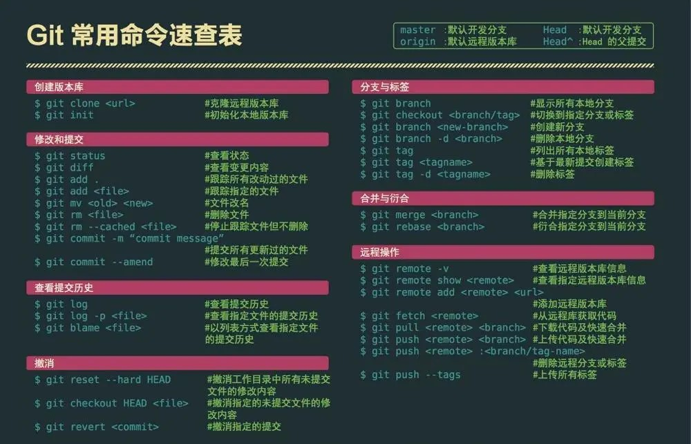

## GIT  
Git是目前世界上最先进的分布式版本控制系统。   
🗺先上一张常用命令图！


## 理解几个概念  
- Remote 远程仓库：放在比如github上文件
- Repository 仓库区：本地电脑的一个仓库
- Stage/index：保存本地修改的内容 
- Workspace：你在电脑里能看到的目录


## 新建代码库
```js
git init //在本地初始化一个git仓库
git init project-name //新建一个目录，将其初始化为Git代码库
git clone url//下载url上的整个项目代码
```

## 配置
```js
git config --list//显示当前的Git配置
git config -e [--global]//编辑Git配置文件
git config user.name "[name]"//设置提交代码时的用户信息
git config user.email "[email address]"//设置提交代码时的用户信息
//如果你要修改当前全局的用户名和邮箱时，需要在上面的两条命令中添加一个参数，–global，代表的是全局。
```

## 增加删除
```js
git add [file1] [file2] ...//添加指定文件到暂存区
git add [dir]//添加指定目录到暂存区，包括子目录
git add .//添加当前目录的所有文件到暂存区
// 添加每个变化前，都会要求确认
// 对于同一个文件的多处变化，可以实现分次提交
git add -p
git rm [file1] [file2] ...//删除工作区文件，并且将这次删除放入暂存区
git rm --cached [file]//停止追踪指定文件，但该文件会保留在工作区
git mv [file-original] [file-renamed]//改名文件，并且将这个改名放入暂存区
```
## 分支
```js
git branch //列出所有本地分支
git branch -r //列出所有远程分支
git branch -a //列出所有本地分支和远程分支
git branch [branch-name] //新建一个分支，但依然停留在当前分支
git checkout -b [branch] //新建一个分支，并切换到该分支
git checkout -b appoint_box（别名） origin/feature/20181128_1491627_appoint_box_1（分支名）
git branch [branch] [commit] //新建一个分支，指向指定commit
git branch --track [branch] [remote-branch] //新建一个分支，与指定的远程分支建立追踪关系
git checkout [branch-name] //切换到指定分支，并更新工作区
git checkout - //切换到上一个分支
git branch --set-upstream [branch] [remote-branch] //建立追踪关系，在现有分支与指定的远程分支之间
git merge [branch] //合并指定分支到当前分支
git cherry-pick [commit] //选择一个commit，合并进当前分支
git branch -d [branch-name] //删除分支
git push origin --delete [branch-name] //删除远程分支
git branch -dr [remote/branch]
```

## 标签
```js
git tag //列出所有tag
git tag [tag] //新建一个tag在当前commit
git tag [tag] [commit] //新建一个tag在指定commit
git tag -d [tag] //删除本地tag
git push origin :refs/tags/[tagName] //删除远程tag
git show [tag] //查看tag信息
git push [remote] [tag]  //提交指定tag
git push [remote] --tags //提交所有tag
git checkout -b [branch] [tag] //新建一个分支，指向某个tag
```
## 查看信息
```js
git status //显示有变更的文件
git log //显示当前分支的版本历史
git log --stat //显示commit历史，以及每次commit发生变更的文件
git log -S [keyword] //搜索提交历史，根据关键词
git log [tag] HEAD --pretty=format:%s //显示某个commit之后的所有变动，每个commit占据一行
git log [tag] HEAD --grep feature //显示某个commit之后的所有变动，其"提交说明"必须符合搜索条件
git log --follow [file] //显示某个文件的版本历史，包括文件改名
git whatchanged [file]
git log -p [file] //显示指定文件相关的每一次diff
git log -5 --pretty --oneline //显示过去5次提交
git shortlog -sn //显示所有提交过的用户，按提交次数排序
git blame [file] //显示指定文件是什么人在什么时间修改过
git diff //显示暂存区和工作区的代码差异
git diff --cached [file] //显示暂存区和上一个commit的差异
git diff HEAD //显示工作区与当前分支最新commit之间的差异
git diff [first-branch]...[second-branch] //显示两次提交之间的差异
git diff --shortstat "@{0 day ago}" //显示今天你写了多少行代码
git show [commit] //显示某次提交的元数据和内容变化
git show --name-only [commit] //显示某次提交发生变化的文件
git show [commit]:[filename] //显示某次提交时，某个文件的内容
git reflog //显示当前分支的最近几次提交
从本地master拉取代码更新当前分支：branch 一般为master //可以得到cimmit id
git rebase [branch]
```

## 远程同步
```js
git remote update  --更新远程仓储
//下载远程仓库的所有变动
git fetch [remote]
//显示所有远程仓库
git remote -v
//显示某个远程仓库的信息
git remote show [remote]
//增加一个新的远程仓库，并命名
git remote add [shortname] [url]
//取回远程仓库的变化，并与本地分支合并
git pull [remote] [branch]
//上传本地指定分支到远程仓库
git push [remote] [branch]
//强行推送当前分支到远程仓库，即使有冲突
git push [remote] --force
//推送所有分支到远程仓库
git push [remote] --all
```

## 撤销
```js
//恢复暂存区的指定文件到工作区
git checkout [file]
//恢复某个commit的指定文件到暂存区和工作区
git checkout [commit] [file]
//恢复暂存区的所有文件到工作区
git checkout .
//重置暂存区的指定文件，与上一次commit保持一致，但工作区不变
git reset [file]
//重置暂存区与工作区，与上一次commit保持一致
git reset --hard
//重置当前分支的指针为指定commit，同时重置暂存区，但工作区不变
git reset [commit]
//重置当前分支的HEAD为指定commit，同时重置暂存区和工作区，与指定commit一致
git reset --hard [commit]
//重置当前HEAD为指定commit，但保持暂存区和工作区不变
git reset --keep [commit]
//新建一个commit，用来撤销指定commit
//后者的所有变化都将被前者抵消，并且应用到当前分支
git revert [commit]
//暂时将未提交的变化移除，稍后再移入
git stash
git stash pop
```

## fetch vs pull
git fetch是将远程主机的最新内容拉到本地，用户在检查了以后决定是否合并到工作本机分支中。  
而git pull 则是将远程主机的最新内容拉下来后直接合并。  
即：git pull = git fetch + git merge，这样可能会产生冲突，需要手动解决。

## 如何解决冲突
- 手动解决: Git用<<<<<<<，=======，>>>>>>>标记出不同分支的内容，选择要保留的部分即可
```js
// Git tracks changes of files.
// <<<<<<< HEAD
// Creating a new branch is quick & simple.
// =======
// Creating a new branch is quick AND simple.
// >>>>>>> feature1
```