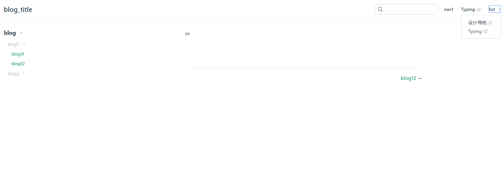
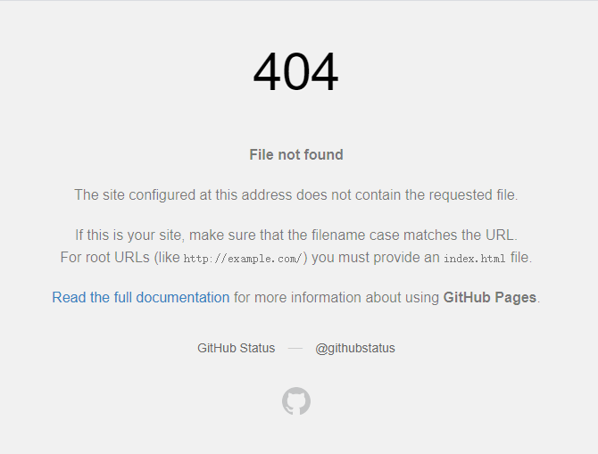

## Vuepress搭建个人博客网站   
拥有个人网站性价比最高的方法就是把网站放到github上，不用自己花钱买服务器开发，也不用考虑续费的问题。此篇文章主要讲述如何用vuepress在github上部署一个个人博客网站。咸鱼漫步，多多指教啊🤡 
📑 此处附上[Vuepress官方文档](https://vuepress.vuejs.org/zh/guide/)  

[[toc]]

---
### 一、准备工作
:one: **在github上新建一个仓库**  
  
&emsp;① <u>仓库名称</u>：此处的仓库名称是固定的 `github用户名 + .github.io` 这正是你博客的地址   
&emsp;&emsp;:chestnut:：如果用户名为banana,则此处应该填：`banana.github.io`  
&emsp;② <u>仓库描述</u>： 用户可自定义仓库的描述，方便读者了解此仓库的主要用途，此处放的是博客链接  
&emsp;③ <u>建立仓库</u>  
:two: **环境搭建**   
&emsp;① Node>8  
&emsp;② Git  
&emsp;③ npm
### 二、搭建vuepress项目  
:one: **全局安装vuepress** `npm install -g vuepress`  
:two: **初始化项目** 
```    
mkdir vurpressBlog  
cd vurpressBlog
npm init  
mkdir docs
cd docs
touch README.md  
mkdir .vuepress
cd .vuepress
mkdir .public
touch config.js
```  
🎄项目结构
```
.
├─ docs
│  ├─ README.md      homepage信息
│  └─ .vuepress
│     ├─ public      存放静态文件如favicon.ico
│     └─ config.js   项目配置文件
└─ package.json
```  
:three: **配置文件**  
&emsp;&emsp;✧ package.json：添加两条启动命令  
```
"scripts": {
        "dev": "vuepress dev docs", //启动项目
        "build": "vuepress build docs" //打包项目
    }
```  
此时运行 `npm run dev` 就可以打开页面了   
&emsp;&emsp;✧ config.js：添加以下代码，并根据路径创建相关文件   
```
module.exports = {
    title: 'blog_title', //网页标题
    decription: 'sss', //网页描述
    // 注入到当前页面的 HTML <head> 中的标签
    head: [
        ['link', { rel: 'icon', href: '/favicon.ico' }], // 增加一个自定义的 favicon(网页标签的图标)放在pulic文件夹下
    ],
    base: '/', //这是部署到github相关的配置
    markdown: {
        lineNumbers: true //代码块显示行号
    },
    themeConfig: {
        sidebarDepth: 2, 
        lastUpdated: 'Last Updated', //文档更新时间：每个文件git最后提交的时间
        // 头部导航栏
        nav:[
            {text: 'nav1', link: 'blog/guild'}, //内部链接以docs为根目录
            { text: 'Typing', link:'https://www.keybr.com/'}, //外部链接
            {text: 'list',
                items:[
                    { text: '设计导航', link:'http://hao.shejidaren.com/'},
                    { text: 'Typing', link:'https://www.keybr.com/'}
                ]
            } //下拉列表
        ],
        sidebar: {
             // 侧边栏在 /blog/上
             '/blog/': [
                {
                    title:'blog',
                    collapsable: true,
                    children: [
                        {
                            title:'blog1',
                            collapsable: true,
                            children: [
                                ['/blog/guild','blog11'],
                                ['/blog/guild','blog12']
                            ]
                        },
                        {
                            title:'blog2',
                            collapsable: true,
                            children: [
                                ['/blog/guild','blog12']
                            ]
                        }
                    ]
                }
            ]
        }
    }
}  
```   
 
&emsp;&emsp;✧ README.md：添加以下代码  
```
---
home: true
heroImage: /header-bg.jpg
heroText: 👩‍💻
tagline: Cogito Ergo Sum
actionText: Banana
actionLink: /guild/install
features:
- title: '今天也要加油鸭🦆'
  details: '咸鱼🐟漫步，每天进步一点点🤪！'
- title: 'HAPPY NEW YEAR🎇'
  details: Only if you ask to see me,our meeting would be meaningful to me.
footer: © 2020-present Six_Banana
---
```
  
### 三、部署到GIthub  
:one: **配置base**  
&emsp;① 如果你打算发布到 `https://<USERNAME>.github.io/`,base 设为 `base: "/"`。（ base 默认即是 "/"。）  
&emsp;② 如果你打算发布到 `https://<USERNAME>.github.io/<REPO>/`（也就是说你的仓库在 `https://github.com/<USERNAME>/<REPO>`）,则将 base 设置为 `base: "/<REPO>/"`。  
:two: **命令行推送**  
```
cd docs/.vuepress/dist //npm run build 将项目打包到dist文件夹，需要注意的是推到线上的是dist文件夹里面的内容（已经将md文件渲染成html文件）
git init 
git add .
git commit -m 'update'
git push https://github.com/<USERNAME>/<REPO>.git master
``` 
💁‍♀️然后访问`https://<USERNAME>.github.io`见证奇迹（第一次可能延时个一分钟左右）  

:three: **脚本推送**  
&emsp;① 在project的根目录下，创建一个deploy.sh文件：
```
#!/usr/bin/env sh

# 确保脚本抛出遇到的错误
set -e

# 生成静态文件
npm run docs:build

# 进入生成的文件夹
cd docs/.vuepress/dist

# 如果是发布到自定义域名
# echo 'www.example.com' > CNAME

git init
git add -A
git commit -m 'deploy'

# 如果发布到 https://<USERNAME>.github.io  USERNAME=你的用户名 
# git push -f git@github.com:<USERNAME>/<USERNAME>.github.io.git master
git pudh -f https://github.com/banana6hz/Work.git master
# 如果发布到 https://<USERNAME>.github.io/<REPO>  REPO=github上的项目
# git push -f git@github.com:<USERNAME>/<REPO>.git master:gh-pages

cd -
```  
&emsp;② 设置package.json： 
```
{
  "scripts": {
    "d": "bash deploy.sh"
  }
}
```
&emsp;③ 执行命令：`npm run d`  
🎄项目结构
```
.
├─ docs
│  ├─ .vuepress
│  |  ├─ dist
│  |  ├─ public
|  |  └─ config.js
|  ├─ blog
|  |  └─ guild.md
│  └─ README.md
├─ node_modules
└─ package.json
```  
💢💢💢 偶尔会出现这样的页面❌那就再build一次再push就好了     


