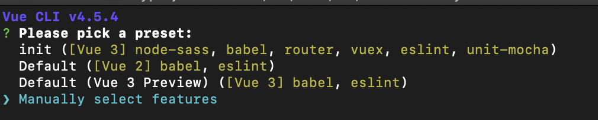
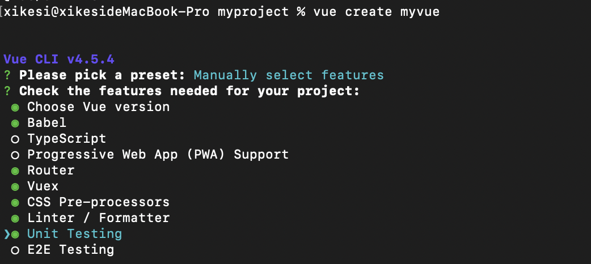
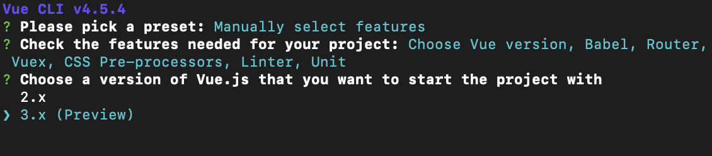
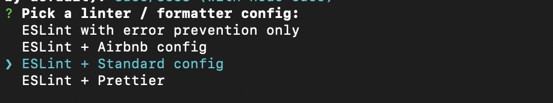
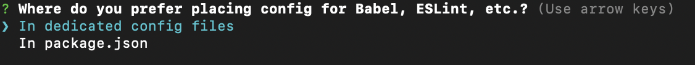

## vue-cli工程化  
在一个项目越来越大的时候，要如何搭建项目才能更好的体现模块化，或者说提高可拓展性呢？首先先来学学一些简单的模块化操作吧！
1. 创建一个vue项目  
1.1 安装@vue/cli
```js
npm install -g @vue/cli
```
1.2 初始化项目
```js
vue create myvue
```

a.选择一个预设  

可以选择默认，默认预设包含了`babel`,`eslint`  
我们选择更多功能 `Manually select features`

b.插件选择  

这边选择了（Babel、Router、Vuex、Css预处理器、Linter / Formatter 格式检查、Unit测试框架）

c.选择vue版本

为了表示自己很厉害的样子，这里选择了vue3.0

e.路由模式选择

是否使用 `history` 模式的路由 （Yes）

d.选择一个css预处理器（Sass/Scss)
 

e.选择一个eslint配置

有几种代码规范可以选择，具体差别可以自己百度一哈

f.选择什么时候进行`eslint`校验

选择（Lint on save）保存时检查，如果你正在使用的vscode编辑器的话，可以配置eslint插件进行代码自动格式化

g.选择测试框架 (Mocha + Chai）


h.选择将这些配置文件写入到什么地方 (In dedicated config files)


i.是否保存这份预设配置？（y）

选是的话，下次创建一个vue项目，可以直接使用这个预设文件，而无需再进行配置。

然后就是等待⌛️

2.进行简单配置


