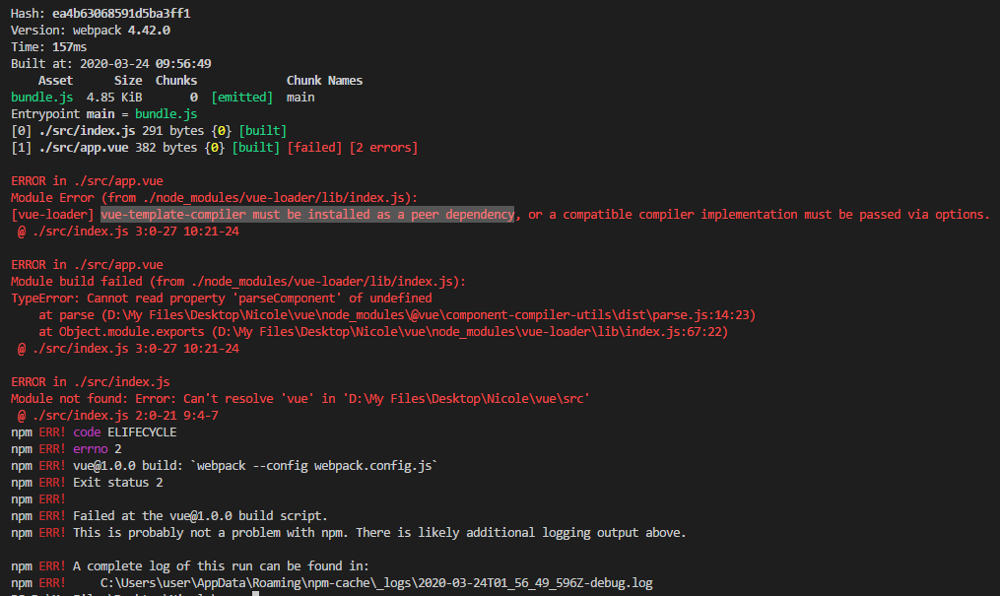
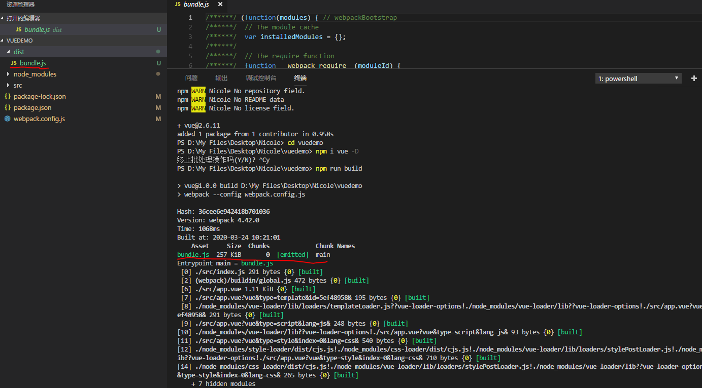
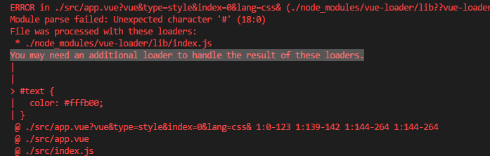

## 手动搭建Vue项目
::: tip  
💡 为了更好的学习和理解Vue的配置，所以试一下不用vue-cli手动搭建一下Vue项目。
:::

✨ :one:  新建一个文件夹，运行 `npm init` 初始化项目，运行之后会生成一个项目的配置文件 **package.json**  

✨ :two:  安装项目的 **webpack** **vue-loader** 依赖包, 运行 `npm i webpack vue-loader`  

✨ :three: 安装成功之后根据提示继续安装 **css-loader**
  

✨ :four:  在根目录下新建 **src** 文件夹，在文件夹下新建 **App.vue** 文件和 **index.js** （入口）文件
- **App.vue**  

- **index.js**  
  


✨ :five: 在根目录下创建 webpack 基本配置文件 **webpack.config.js**
- webpack.config.js  
  


✨ :six: 打开 **packjson.js** 添加打包命令 `"build": "webpack --config webpack.config.js"`
- **packjson.js**  
  


✨ :seven: 运行 `npm run build` 显示要安装 **webpack-cli**，根据提示安装即可（说是cli包是因为webpack4之后强制要求安装？），安装之后还是报错了❗

这个错误呢就是告诉我们，需要为app.vue这个文件声明一个loader，因为webpack只支持js类型的文件，在 **webpack.config.js** 添加module配置项
```javascript 
module.exports = {
    // 配置入口文件
    entry: path.join(__dirname,'src/index.js'),
    // 配置输出文件夹
    output:{
        filename: 'bundle.js',
        path: path.join(__dirname, 'dist')
    },
    module: {
        rules: [
           {//通过vue-loader来识别以vue结尾的文件
             test: /.vue$/, 
             loader: 'vue-loader'
           }
        ]
      }
}
```    

✨ :eight: 再运行一遍 `npm run build` ,哎呀怎么还是报错了。

这时候的错误是告诉我使用vue-loader的方式不正确。因为在vue-loader@15.x 版本，有些东西必须要配置，我们在 **package.config.js** 文件中添加 **VueLoaderPlugin**，代码如下：
```javascript
//webpack.config.js 基本配置
const path = require('path');//nodejs里面的基本包，用来处理路径
const { VueLoaderPlugin } = require('vue-loader');
//或者const VueLoaderPlugin = require('vue-loader/lib/plugin');
或者
const { VueLoaderPlugin } = require('vue-loader');
// __dirname表示文件相对于工程的路径
module.exports = {
    // 配置入口文件
    entry: path.join(__dirname,'src/index.js'),
    // 配置输出文件夹
    output:{
        filename: 'bundle.js',
        path: path.join(__dirname, 'dist')
    },
    plugins: [
      // make sure to include the plugin for the magic
      new VueLoaderPlugin()
    ],
    mode:'none',
    module: {
        rules: [
           {//通过vue-loader来识别以vue结尾的文件
             test: /.vue$/, 
             loader: 'vue-loader'
           }
        ]
      }
}
```  
  
✨ :nine: 再运行一遍 `npm run build` ,报错again,我们需要再安装一个处理template模板的依赖 `npm i  vue-template-compiler -D`  


✨ :ten: 我们再来Biu~一下看看，不负众望，又报错了哈哈哈...

报错是因为我们写的样式是CSS,但是webpack并没有处理css的能力，所以我们还需要在moudle添加rules配置项，如下：
```javascript
module: {
        rules: [
           {//通过vue-loader来识别以vue结尾的文件
                test: /.vue$/, 
                loader: 'vue-loader'
           },
            {
                test: /.css$/, 
                //css的处理方式不同，有嵌入在页面style标签里的，有从外部文件引入的，我们这里用use来声明
                use: [
                'style-loader',//接受潜在页面内部的style标签的文件。
                'css-loader'
                ]
            }
        ]
      }
    }
```
并执行一下`npm i style-loader`  

✨ :eleven: 再biu~一下,发现还是报错， Can't resolve 'vue'，发现是漏安装 **vue**了，执行`npm i vue -D`,安装成功之后，再biu一下~

看到这样就是打成功了
https://blog.csdn.net/Tokki_/article/details/90766971


emmm这是爬坑记录不算🙅‍♀️

