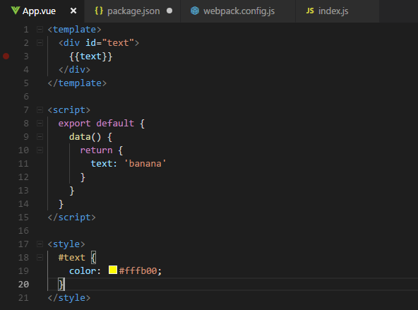
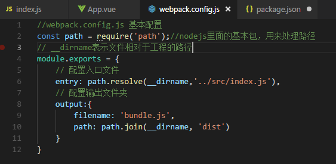
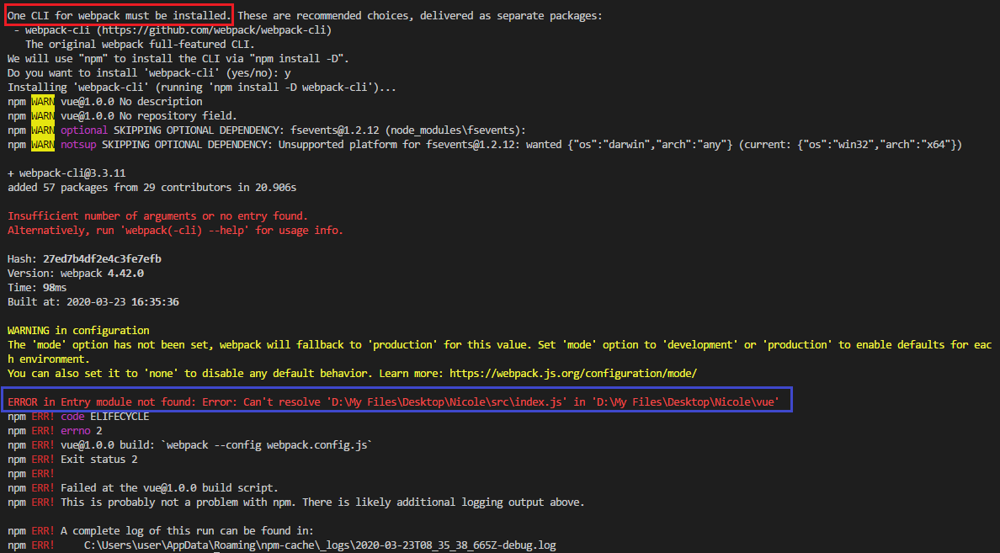
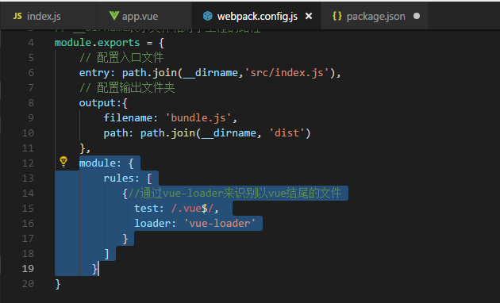

## 手动搭建Vue项目
为了更好的学习和理解Vue的配置，所以试一下不用vue-cli手动搭建一下Vue项目。

1. 新建一个文件夹，运行 `npm init` 初始化项目，运行之后会生成一个项目的配置文件 `package.json`  
2. 安装项目的 `webpack` `vue-loader` 依赖包, 运行 `npm i webpack vue-loader`
3. 安装成功之后根据提示继续安装 `css-loader`

4. 在根目录下新建 src 文件夹，在文件夹下新建 App.vue 文件和 index.js （入口）文件
- App.vue

- index.js

5. 在根目录下创建 webpack 基本配置文件 `webpack.config.js`
- webpack.config.js

6. 打开 `packjson.js` 添加打包命令 `"build": "webpack --config webpack.config.js"`
- packjson.js

7. 运行 `npm run build` 显示要安装 `webpack-cli`，根据提示安装即可（说是cli包是因为webpack4之后强制要求安装？），安装之后还是报错了❗

这个错误呢就是告诉我们，需要为app.vue这个文件声明一个loader，因为webpack只支持js类型的文件，添加即可

https://blog.csdn.net/Tokki_/article/details/90766971

