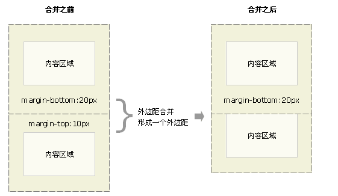
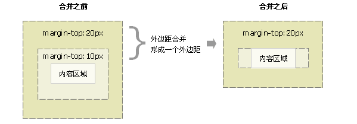

## :white_medium_square: 1. 什么是盒子模型

盒子模型分为两种

- 标准盒模型: W3c 标准的盒子模型
    
   **盒子的大小** = `content + border + padding + margin`  
   **元素宽度** = `content`

- 怪异盒模型: IE 标准的盒子模型  
     
   **盒子的大小** = `width（content + border + padding） + margin`  
   **元素宽度** = `content + border + padding`

- 转换方式
  - `box-sizing:content-box` 时，采用标准模式进行计算，默认就是这种模式
  - `box-sizing:border-box` 时，采用怪异模式进行计算
- chrome 默认的盒模型是标准模型

## :white_medium_square: 2. CSS 优先级算法如何计算？

- 最近的祖先元素大于其他祖先元素
- 从父元素继承的样式具有最低优先级，任何选择器都可以改变其最终作用的样式
- important！<span style="color: #D83930"> > </span> ID 选择器 <span style="color: #D83930"> > </span> 伪类选择器 <span style="color: #D83930"> > </span> 属性选择器 <span style="color: #D83930"> > </span> class 选择器 <span style="color: #D83930"> > </span> 元素选择器 <span style="color: #D83930"> > </span> 伪元素选择器

## :white_medium_square: 3. margin 的坍塌以及解决方法

是指用 margin 定义**垂直方向**的外边距的时候，可能会出现外边距的**合并**。只有普通文档流中块框的垂直边界才会发生边界叠加。行内框、浮动框或绝对定位框之间的边界不会叠加。

- **相邻**块元素垂直外边距塌陷：`margin-bottom + margin-top`, 取较大值
  
  解决方法：
  - 只给其中一个元素设置 `margin-top`, `margin-bottom` <span style="color: #D83930">（推荐）</span>
  - 给第二个元素包一层 div，设置属性 `overflow:hidden` <span style="color: #D83930">（不推荐，因为这样会改变原有的 HTML 解构）</span>
  - 后面的元素用 `float` 脱离文本流 `float:left;display:inline;`
- **嵌套块**元素垂直外边距的塌陷: `margin-top + margin-top`, 取较大值  
  
  解决方法：
  - 创建一个 BFC，给父元素添加属性 `overflow:hidden` /` position: fixed` / `position: absolute` / `display:inlin-block` / `display:flex` / `display:block`
  - 给父元素添加 `border` / `padding` 属性:`border:1px solid transparent;`,`padding:1px;`
  - 给子元素添加一个兄弟元素，属性为 `content:"";overflow: hidden;`
  - 将子元素的 `margin` 换成父元素的 `padding`

## :white_medium_square: 4. BFC 的概念

**BFC**: 全称<span style="color: #4452ee">Block Formatting Context</span>，块级格式化上下文。它决定了元素如何对其内容定位，以及与其他元素的关系和相互作用。当进行可视化布局时，BFC 可以提供一个环境，html 可以在这个环境中按照一定规则进行可视化布局。是一个独立不干扰外界也不被外界干扰的盒子——块格式化上下文  
**如何创建一锅 BFC**：

- float 不为 none
- 绝对定位 position 为 absolute 或 fixed
- display:inline-block/table/tabel-cell/tabel-caption
- 弹性盒子:display: flex
- overflow: hidden

**特点**:

- 让处于 BFC 内部的元素与外部的元素相互隔离，使内外元素的定位不会相互影响。
- 一个元素不能同时存在于两个 BFC 中。
- 内部的盒会在垂直方向一个接一个排列（可以看作 BFC 中有一个的常规流）；
- 处于同一个 BFC 中的元素相互影响，可能会发生 margin collapse；
- 每个元素的 margin box 的左边，与容器块 border box 的左边相接触(对于从左往右的格式化，否则相反)。即使存在浮动也是如此；
- BFC 就是页面上的一个隔离的独立容器，容器里面的子元素不会影响到外面的元素，反之亦然；
- 计算 BFC 的高度时，考虑 BFC 所包含的所有元素，连浮动元素也参与计算；
  浮动盒区域不叠加到 BFC 上；

**BFC 解决了什么问题**：

- 解决因为使用 Float 脱离文档流，造成的高度塌陷
- margin 造成的高度坍塌

## :white_medium_square: 5. 各种 CSS 属性的百分比计算规则

- margin 和 padding 的百分比: 根据父元素的宽度和高度来计算
- translate 的百分比: 根据自身的宽高来计算
- position:absolute 的元素的 top/left 的百分比: 根据其对照元素的宽高计算
  > 如果相对元素有 padding, 在标准盒子模型下，根据其对照元素的（宽高+padding）计算，在怪异盒子模型下，根据其对照元素的宽高计算

## :white_medium_square: 6. CSS 实现水平垂直居中

#### 内联元素居中布局

- **水平居中：**
  - 行内元素:
    `text-align:center`
- **垂直居中**
  - 单行文本父元素确认高度：
    `line-height:height;`
  - 多行文本父元素确认高度:
    `display:table-cell;vertical-align:center`

#### 块级元素居中布局

- **水平居中：**
  - `margin:0 auto`
  - `margin-left:auto;margin-right:auto`
- **垂直居中：**
  - `(父)display:flex;justify-content:center;`
  - `(父)display:flex;(子)margin:auto;;`
  - `(父)position:relative;(子)position:absolute;margin:auto;`
  - `(父)position:relative;(子)position:absolute;top:50;transform:translateY(-50%);`
  - 设置 inline-block（多个块状元素）
    ```js
    .center{text-align:center;}
    .inlineblock-div{display:inline-block;}
    <div class="center">
      <div class="inlineblock-div">1</div>
      <div class="inlineblock-div">2</div>
    </div>
    ```
- tabel
  父元素 `dispaly:table` ,子元素`text-align:center`,`vertical-align:middle`
  父元素 `display:table`, 子元素 `display:table-cell;vertical-align:middle;`
  [参考文档](https://juejin.im/entry/55a8ce76e4b0c78cf60ac924)

## :white_medium_square: 7. 常用布局的实现方法

- 流式布局：等比例缩放的布局方式，也称百分比自适应的布局，实现方法是将 CSS 固定像素宽度换算为百分比宽度
- 响应式布局：指同一页面在不同屏幕尺寸下有不同的布局，实现方法：媒体查询，百分比布局，rem(字体适配)，max-width(图片的适配)，视口单位 vh, vw
- 弹性布局： flex 布局
- 网格布局：Grid 布局

#### 响应式布局

- @media
- 百分比
- rem/em
- flex
- 视口单位 vw/vh
  _和百分比很像，区别是百分比基于祖先元素，vw/vh 基于视窗（横屏之后宽高对换）_
- 栅格系统`Bootrap`

#### 三栏布局

- left 块为左浮动，right 为右浮动，center 放中间不设宽就会自动撑开
- 绝对定位，左边 left:0;右边 right:0,中间设置相应的 left、right
- 容器设置 display:tabel,容器内 items 设 display:tabel-cell,左右设宽，中间自动撑开
- 设置容器为 flex,左右两边设宽，中间 flex:1

#### 几种布局的区别

- 静态布局：定宽布局
- 流式布局：页面元素根据屏幕分辨率进行适配调整，整体布局不变，代表：栅格系统
- 响应式布局：通过媒体查询等方法，针对不同尺寸大小的终端显示令人满意的效果
- 自适应布局：通过检测访问设备(PC、Ipad、手机)，返回相应的页面

## :white_medium_square: 8. 如何响应式设计 viewport

**viewport**：是指网页的可视区域。

- width：控制 viewport 的大小，可以指定的一个值，如 600，或者特殊的值，eg: width=device-width 表示页面宽度为设备的宽度）。
- height：和 width 相对应，指定高度。
- initial-scale：初始缩放比例，也即是当页面第一次 load 的时候缩放比例。eg:initial-scale=1.0 代表初始页面不缩放。
- maximum-scale：允许用户缩放到的最大比例。
- minimum-scale：允许用户缩放到的最小比例。
- user-scalable：用户是否可以手动缩放。eg:user-scalable=0 代表可以缩放

通常网页的写法都是
`<meta name="viewport" content="width=device-width, initial-scale=1.0, maximum-scale=1.0, user-scalable=0" />`

- 为什么有了`width=device-width`规定网页展示大小和设备大小一样了，还要加上`initial-scale=1.0`呢？
  因为 iphone、ipad 以及 IE 会横竖屏不分，通通以竖屏的 ideal viewport 宽度为准。所以，最完美的写法应该是，两者都写上去，这样就 initial-scale=1 解决了 iphone、ipad 的毛病，width=device-width 则解决了 IE 的毛病。
- 如果 width 和 initial-scale=1 同时出现，并且还出现了冲突，如下：
  `<meta name="viewport" content="width=400, initial-scale=1">`

页面会以哪个为标准呢？
<font color="#f34134;">会以数值大的那个为标准</font>。如果 initial-scale=1 的数值为 500，大于 width 的数字 400，页面的展示宽度则以 initial-scale=1 为准；如果 initial-scale=1 的数值为 370，小于 width 的 400，页面的展示则以 width=400 为准。

- css 中的 1px 并不等于设备的 1px
  在桌面浏览器中，我们可以近似的理解为浏览器中 css 的 1 个像素对应着电脑屏幕的 1 个物理像素（但并不意味这是完全的对等，只是在此不讨论）
  在移动设备中，分辨率为 320x480 的 iphone3 的一个 css 像素确实是等于一个屏幕物理像素，。但随着技术不断的更新，出现了更高的分辨率以及更复杂的像素密度等级，设备上的一个 css 像素相当于多少个屏幕物理像素，因设备的不同而不同。

## :white_medium_square: 9. SVG 和 Canvas 的区别？

- **SVG**是矢量图形，放大不会失真。**Canvas**是标量图形，放大会失真或有锯齿。
- **SVG**绘制出来的每一个图形都是独立 DOM 节点，能都方便绑定事件和修改。**Canvas**绘制出来是一整张画布
  

## :white_medium_square: 10.移动端适配的方案

为什么要移动端适配  
因为现在移动端有很多种尺寸，每个品牌的手机都有着不同的物理分辨率，如果是左右布局，左边固定宽度，右边自适应的话，不同设备右边能放的东西就不一样多了，为了让页面在物理像素的设备里展示的内容一致，就需要做移动端适配了。

## :white_medium_square: 11. 理解 z-index

z-index 是 css 的属性,用于定义一个元素在屏幕 Z 轴上的层叠顺序，且仅在定位元素非 static 的元素上有效。而元素在 Z 轴上的层叠顺序除了受 z-index 影响外还和元素的层叠上下文和层叠等级有关
层叠上下文：可以理解为比普通元素在 Z 轴上更高一层的元素。一个页面可以有多个层叠上下文
层叠等级：

- 在普通元素中，表示在 Z 轴上的上下顺序
- 同一个层叠上下文中，表示该层叠上下文中的层叠上下文元素在 Z 轴上的上下顺序。
- 如果不在同一个层叠上下文去比较层叠顺序是没有意义的
  层叠顺序：是指在不考虑 CSS3 的情况下，元素层叠的规则

  
比较规则：

- 如果不在同一层叠上下文，先比较他们所在的层叠上下文的层叠顺序
- 如果在同一层叠上下文，z-index 的等级越大的在最上面
- 如果在同一层的上下午，z-index 的等级相同，在 DOM 结构中后面的元素会覆盖之前的元素
  如何产生层叠上下文
- HTML 根元素就是一个根层叠上下文
- 普通元素设置 position(非 static)并设置 z-index，会产生层叠上下文
  每一次改变 z-index 都会引起重绘和回流，所以还是尽量少用比较好。

## :white_medium_square: 12. 理解重构和回流

**重构**:当页面的样式发生改变
**回流**:当 DOM 结构发生改变

- 改变元素的几何属性：`width` / `height` / `padding` / `margin` / `left` / `top` / `border`
- dom 节点的新增和删除
- 调用 `window.getComputedStyle` 方法
- 读写 `offset` 族、`scroll` 族和 `client` 族属性的时候，浏览器为了获取这些值，需要进行回流操作。

回流一定发生重绘，重绘不一定会发生回流
合成
利用 `CSS3` 的 `transform`、`opacity`、`filter` 这些属性就可以实现合成的效果，也就是大家常说的 GPU 加速
渲染流水线是这样的顺序：重排 -> 重绘 -> 合成
`transform: translate` 是直接合成，跳过了前面的重排重绘。所以 `transform` 属性不会发生回流
减少回流的方法

- 避免使用大量的 `style`，采用修改 class 的方式
- 对于 resize、scroll 等进行防抖/节流处理
- 使用 createDocumentFragment 进行批量的 DOM 操作。

## :white_medium_square: 13. 行内元素和块级元素分别有哪些？有何区别？怎样转换？

- 行内元素：span b strong i img input select `<textarea>` label
  - 行内元素会在一行上从左到右水平排列，直到一行排列不下，才会换行
  - 行内元素设置宽高无效,但可以用 line-height 设置高度
  - 行内元素设置 padding margin 的垂直方向无效，水平方向有效
  - 行级元素只能容纳文本或者其它行内元素
- 块级元素：div p h1 form ul li
  - 每个块级元素独占一行，默认从上到下排列
  - 高度、行高以及外边距和内边距都是可以设置的
  - 块级元素可以容纳其它行级元素和块级元素
- 可以通过 display 属性对行内元素和块级元素进行切换
  ☝️ 关于行内元素设置 padding 的垂直方向无效
  我尝试了只给行内元素设置垂直方向的 padding 发现该元素的 top 和 bottom 是有 padding,觉得很奇怪就去检索了下，找到 W3C 的以下解释
  > While padding can be applied to all sides of an inline element, only left and right padding will have an effect on surrounding content. In the example below, 50px of padding has been applied to all sides of the element. As you can see, it has an affect on the content on each side, but not on content above or below
  > 大概意思就是：当我们使用内边距时，只有左右方向有效；当我们设置四个方向的内边距时，对于该行内元素，确实显示出效果，但是竖直方向的内边距只有效果，对其他元素无任何影响
  > 也就是说，虽然可以通过浏览器的样式看出来效果，但是实际上这个 padding 并不会造成页面的排版有什么变化。为了更好的理解，可以将该行内元素添加样式 display:inline-block 就可以看出区别，添加之后该行内元素的高度发生变化，而没有添加的时候，虽然在垂直方向上有 padding,但并没有实际意义, 因为它没有撑大盒子，不会对周围的元素产生影响。

## :white_medium_square: 14. 清除浮动的方式

浮动的缺点：浮动元素一旦脱离了文档流，就无法撑起父元素，会造成父级元素的高度塌陷。
**清除浮动**：

- 添加空元素`<div style="clear:both"></div>`
- 父元素设置`overflow:hidden;`
- 添加伪类`.parent:after{content:'';display: block;height:0;visibility:hidden;clear:both;}`

## :white_medium_square: 15. Sass 和 Less 的异同？

**Sass**和**Less**都是 CSS 的预处理器。
其基本思想是：用一种专门的编译语言，为 CSS 增加一些编程的特性，并将 CSS 作为目标生成文件。

### 相同之处

- **混入(Mixins)**--class 中的 class

```js
//Sass
@mixin rounded-corners {
  -moz-border-radius: 5px;
  -webkit-border-radius: 5px;
  border-radius: 5px;
}
.notice {
  background-color: green;
  border: 2px solid #00aa00;
  @include rounded-corners;
}
//Less
.bordered {
  border-top: dotted 1px black;
  border-bottom: solid 2px black;
}
.post a {
  color: red;
  .bordered();
}
```

- **参数混入**：可以传递参数的 class，就像函数一样

- **嵌套规则**

```js
//Sass
#content {
  article {
    h1 { color: #333 }
    p { margin-bottom: 1.4em }
  }
}
//Less
#header {
  color: black;
  .navigation {
    font-size: 12px;
  }
  .logo {
    width: 300px;
  }
}
```

- **运算**：CSS 中用上数学,可以编辑颜色。

```js
@color: #224488 / 2; //结果是 #112244
background-color: #112244 + #111; // 结果是 #223355
```

- **作用域**

```js
//Less
@var: red;
#page {
  @var: white;
  #header {
    color: @var; // white
  }
}
```

- **继承**

```js
//Sass
.block {
  margin: 10px 5px;
  padding: 2px;
}
p {
  @extend .block; /* Inherit styles from '.block' */
  border: 1px solid #EEE;
//Less 更像是混入写法
.block {
  margin: 10px 5px;
  padding: 2px;
}
p {
  .block; /* Inherit styles from '.block' */
  border: 1px solid #EEE;
}
```

- **导入**

```js
//不需指明被导入文件的全名。
//Sass
@import "color";//color.scss
//Less
@import "library"; // library.less
@import "typo.css";
```

#### 不同之处

- **运行环境**：Sass 基于 Ruby,通过服务器处理；Less 基于 JS，通过客户端处理；所以 Sass 会解析地比 Less 快一点。(Less 也可在服务端运行 (借助 Node.js)。)
- **定义变量**：Sass 用$定义变量，Less 用@定义变量

## :white_medium_square: 16. px、rem 和 em 的原理和区别

**px 像素(Pixel)**：相对单位，相对于显示器屏幕分辨率。
一般电脑分辨率有 1920 _ 1024、1024 _ 768、1280 \* 768，所以 1px 在这些分辨率不同的电脑上显示的实际大小是不一样的。

_今天面试完才知道自己之前对 rem 和 em 的理解是错的？_
**rem**作用于<font color="#f34134">非根元素</font>时，相对于根元素字体大小；
**rem**作用于<font color="#f34134">根元素</font>字体大小时，相对于其出初始字体大小。
**原理**：将不同的屏幕划分为相同的份数，让同一个元素在不同的屏幕上占据相同比例的空间。
假设把屏幕分为十等分，那 1rem 等于多少 px 呢：
`1em = document.documentElement.clientWidth / 10 + 'px'`
所以说它和视窗大小是有关的呀！！

em：相对单位，相对于其父元素
