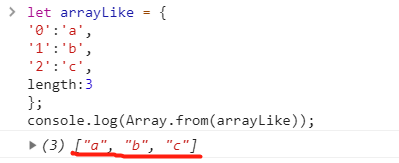

## 它干了什么？  
👉👉 `Array.from(new Set(arr.flat(Infinity))).sort((a, b) => { return a - b })`  

⭕ **arr.flat(Infinity)**   
数组扁平化。所谓数组扁平化就是将数组中并不规则的多维数组<u>去除维度</u>，使之变为一维数组。  
`let newArray = arr.flat(depth)`   
**flat()** 方法会按照一个<u>可指定的深度</u>递归遍历数组，并将所有元素与遍历到的子数组中的元素合并为一个新数组返回。 
但使用 Infinity 作为深度，展开<u>任意深度</u>的嵌套数组。
```js
var arr = [ [1, 2, 2], [3, 4, 5, 5], [6, 7, 8, 9, [11, 12, [12, 13, [14] ] ] ], 10];
console.log(arr.flat(Infinity)) 
//[1, 2, 2, 3, 4, 5, 5, 6, 7, 8, 9, 11, 12, 12, 13, 14, 10]
```
⭕  Set()是ES6提供的新的数据结构，类似于数组，但不会有重复的值。  
```js
var arr = [ [1, 2, 2], [3, 4, 5, 5], [6, 7, 8, 9, [11, 12, [12, 13, [14] ] ] ], 10];
var setArr = new Set(arr.flat(Infinity));
console.log(setArr);
```  
  
⭕  **Array.from()**  
该函数用于将两类对象<u>转化为真正的数组</u>：类似数组的对象、可遍历对象(包括数据结构Set和Map)  
  
如果参数是一个真正的数组，则会返回一个一模一样的数组

⭕  **Array.sort()** 方法用于对数组的元素进行排序。但是这个函数的排序有限，请看下面的栗子：
```js
var arr = [1, 72, 5, 22];
console.log(arr.sort()); //[1, 22, 5, 72]
```
由这个栗子可以看出，并未得出我们想要的结果，因为函数会先将元素转换为字符串,用字符串的首字符进行比较，如果第一个字符相同，继续比较第二个字符。   

如果真的要对数组进行严格的升序排列，可以使用**Array.sort((a, b) => { return a - b })**。  
那它是怎么实现的呢？可以来看看这个函数    
   
- return a-b 这段代码：a指的是array[j] b指的是array[j+1] 即 <u>a 指的是前一个数，b指的是后一个数；</u>
- a-b>0时，也就是 第一个数比第二个数大,则在if语句中 fncompare()函数的结果为>0
所以if语句可以执行，两个数交换位置 a 数 换到 b 的位置 意思是 ：<u>大的数向后移动</u>

同理 可以知道 return b-a 就是倒序。

5. 最终结果：返回一个升序并且去重的一维数组
```js
var arr = [ [1, 2, 2], [3, 4, 5, 5], [6, 7, 8, 9, [11, 12, [12, 13, [14] ] ] ], 10];
console.log(Array.from(new Set(arr.flat(Infinity))).sort((a, b) => { return a - b }));
//[1, 2, 3, 4, 5, 6, 7, 8, 9, 10, 11, 12, 13, 14]
```


## 深拷贝和浅拷贝  
因为对象的赋值过程其实复制的是<u>地址</u>，这就导致了修改一方的属性会影响到另一方，但是实际开发中我们并不想要这样的结果，我们可以用浅拷贝来实现这个问题。  
**Object.assign()**：<font color="#425fe">会把源对象的所有可枚举属性复制到目标对象。</font>  
```js
var target = {a:18};
var source1 = {s1:20};
var source2 = {s2:22};
Object.assign(target,source1,source2);
target//{a: 18, s1: 20, s2: 22}
source1.s1 = 100;
target////{a: 18, s1: 20, s2: 22}
```
这是ES6书上的用法，我们来看看用了浅拷贝和不用浅拷贝的区别。  
```js
//不用浅拷贝
var a = {age:18};
var b = a;
a.age = 22;
console.log(b.age)//22

//用了浅拷贝
var a = {age:18};
var b = Object.assign({},a);//目标对象是空对象，源对象是a
a.age = 22;
console.log(b.age)//还是18
```
浅拷贝只能解决第一层的问题，如果第二层属性为对象，那还是回到了原来，两者拥有相同的地址  
```js
var a = {
    age:18,
    name:{
        firstName:"banana",
        lastName:"apple"
    }
};
var b = Object.assign({},a);//目标对象是空对象，源对象是a
a.name.firstName = "lemon";
console.log(b.name.firstName)//lemon
```
上面的栗子中，a的name属性是一个对象，与b.name拥有同一个地址，所以修改一方，会影响另一方。如果我们想要他们互相独立，互不影响的话，这个时候就需要深拷贝了。  
深拷贝的实现方法靠：**JSON.parse(JSON.stringify(Object))**  
```js
var a = {
    age:18,
    name:{
        firstName:"banana",
        lastName:"apple"
    }
};
var b = JSON.parse(JSON.stringify(a));//目标对象是空对象，源对象是a
a.name.firstName = "lemon";
console.log(b.name.firstName)//banana
```
这个方法可以解决大部分的的问题，但也有局限性：  
- 会忽略undefined;
- 会忽略symbol
- 不能序列化函数
- 不能解决循环引用的对象
```js
var a = {
    age:18,
    name:undefined,
    sex:Symbol('male'),
    fun:function(){alert(age)},
    b:{
        c:18
    }
};
var b = JSON.parse(JSON.stringify(a));
a.d=a.b.c
console.log(b)//{a:18,b:{c:18}}
```
如果出现上面的这些情况，就需要复杂一点多的深拷贝了，这个咋后面慢慢学
