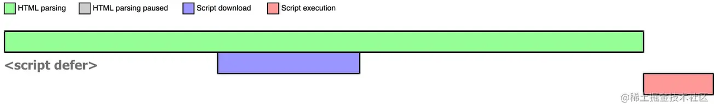
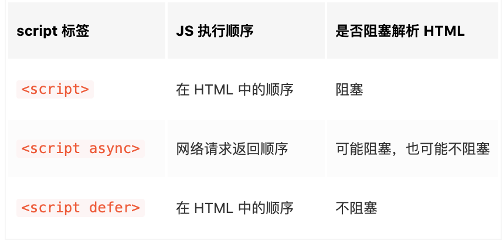

### HTML

## :white_medium_square: 1. html 语义化

html 具有一些<b>实际意义</b>的标签，比如`<aside>` `<footer>`  
我们给某一块内容加上最恰当最合适的标签，从而
- 让页面结构在没有 css 的情况下也能很<b>清晰</b>，不管是谁都能看懂这段内容是干什么的
- 有利于 <b>SEO</b> 和搜索引擎建立良好的沟通，有助于爬虫抓取更多的有效信息
- 方便团队开发和维护，语义化更具<b>可读性</b>

## :white_medium_square: 2. 什么是 DOCTYPE， 有何作用？

是一种文档声明，它告诉浏览器应该用哪一种 HTML 版本标准去解析文档(<b>严格模式</b>)
常见`<!DOCTYPE html>`是指用 HTML5 的标准去解析文档。
如果没有这个声明，浏览器就不知道该用什么标准去解析文档，大部分浏览器将开启最大的兼容模式去解析，我们一般称<b>混杂模式/怪异模式</b>，而不同的浏览器的解析是有差异性的，就可能导致一个网页在不同浏览器的呈现效果不一样，而且在解析过程中可能会产生一些难以预料的 bug

## :white_medium_square: 3. src 和 href 的区别

- src: 表示引用资源，表示<b>替换当前元素</b>，常用于`img`,`video`,`script`，当浏览器解析到该元素时，会暂停其他资源的下载，直到将该资源加载、编译、执行完毕
- href：识超文本引用，在当前元素和引用资源之间<b>建立联系</b>，常用于`a`,`link`会下载并且不会停止对当前文档的处理

## :white_medium_square: 4. HTML5 新增了哪些新特性，移除了哪些？

<b>新增</b>

- 语义化标签： `header` `footer` `nav` `main` `article` `section` 等
- 增强型表单控件：
  - 新的 `input` 类型：calendar、date、time、email、url、search 等，例如可以通过 input 的 type 属性指定类型是 number 还是 date 或者 url
  - 新的表单元素： 
    - `datalist`(指定一个预先定义的输入控件选项列表) 
    - `keygen`(定义了表单的密钥对生成器字) 
    - `output`(定义一个计算结果)
- 媒体元素： `video` / `audio`
- 绘图： `canvas` / `svg`
- 地理定位：`Geolocation`
- 拖放 API
- Web Storage：`localStrage` `sessionStroage`
- 全双工通讯的协议： `websocket`
- 多任务：Web Worker

<b>移除</b>
- 纯表现的元素：`basefont`、`font`、`strike`、`big`、`center`

## :white_medium_square: 5. 你知道 SEO 中的 TDK 吗？

在 SEO 中，TDK 其实就是 title、description、keywords 这三个标签，  
- `title `表示标题标签  
- `description` 是描述标签  
- `keywords` 是关键词标签

## :white_medium_square: 6. a 元素除了用于导航外，还有什么作用？

href 属性中的 url 可以是浏览器支持的任何协议
- 所以 a 标签可以用来<b>手机拨号</b>`<a href="tel:110">110</a>`
- 也可以用来<b>发送短信</b>`<a href="sms:110">110</a>`，还有邮件 等等
- 当然，a 元素最常见的就是用来做<b>锚点</b>和<b>下载文件</b>。锚点可以在点击时快速定位到一个页面的某个位置，而下载的原理在于 a 标签所对应的资源浏览器无法解析，于是浏览器会选择将其下载下来。

## :white_medium_square: 7. meta 标签的 http-equiv 属性的作用

<b>meta 是什么</b>  
`meta`是一个标签，描述 HTML 文档的元数据，元数据不会显示在客户端，但是会被浏览器解析。  
通常用于指定网页的描述，关键词，文件的最后修改时间，作者及其他元数据。  
可以用于SEO优化，eg:设置keyword,提高网页被搜索的几率  
元数据可以被使用浏览器（如何显示内容或重新加载页面），搜索引擎（关键词），或其他 Web 服务调用。 

<b>http-equiv 属性的作用</b>  
  `http-equiv` 是 meta 标签其中的一个属性，与另外一个属性`content`搭配使用，它有三个值：
- <b>content-type</b>：规定文档的字符编码。eg:`<meta http-equiv="content-type" content="text/html; charset=UTF-8">`
- <b>default-style</b>: 规定要使用的预定义的样式表, eg: `<meta http-equiv="default-style" content="the document's preferred stylesheet">`
- <b>refresh</b>: 定义文档自动刷新的时间间隔，eg:`<meta http-equiv="refresh" content="300">`
> 可以看到 http-equiv 值发生改变的时候，content 也会发生改变，因为他们是相互对应的关系
  ＜ meta http-equiv=“参数” content="参数变量值"＞

## :white_medium_square: 8. 通过 html 标签实现性能优化的手段有哪些

- HTML 标签有始终。 减少浏览器的判断时间
- 把 script 标签移到 HTML 文件末尾，因为 JS 会阻塞后面的页面的显示
- id 和 class，在能看明白的基础上，简化命名，在含有关键字的连接词中连接符号用'-'，不要用'\_'
- 减少不必要的嵌套，尽量扁平化
- 使用 css+div 代替 table 布局，去掉格式化控制标签如：strong，b，i 等，使用 css 控制
- css 和 javascript 尽量全部分离到单独的文件中

## :white_medium_square: 9. form 表单用法，浏览器的默认处理逻辑是什么

form 表单的功能主要是采集客户端信息，并将信息传到服务器，下面介绍下它的几个属性：

- name: 表单的名字
- action：规定当提交表单时向何处发送表单数据(action 的默认值为当前页面的 url 地址)
- target：规定在何处打开 action URL
- methods: 规定用于发送 form-data 的 HTTP 方法  

<b>浏览器的默认处理逻辑</b>：当用户点击 summit 之后，页面就会跳转到 action 指定的 url,并且表单提交后 ，页面之前的状态和数据会丢失

<b>如何阻止表单默认提交行为</b>：当监听到表单的提交事件以后，可以调用事件对象的 event.preventDefault()函数，来阻止表单的提交和页面的跳转,然后由 ajax 向服务器提交表单信息
## :white_medium_square:10. 行内元素和块级元素分别有哪些？有何区别？怎样转换？
- 行内元素：`span` `b` `strong` `i` `img` `input` `select` `textarea` `label`
  - 行内元素会在一行上从左到右水平排列，直到一行排列不下，才会换行
  - 行内元素设置宽高无效,但可以用line-height设置高度
  - 行内元素设置padding margin的垂直方向无效，水平方向有效
  - 行级元素只能容纳文本或者其它行内元素
- 块级元素：`div` `p` `h1` `form` `ul` `li`
  - 每个块级元素独占一行，默认从上到下排列
  - 高度、行高以及外边距和内边距都是可以设置的
  - 块级元素可以容纳其它行级元素和块级元素
- 可以通过display属性对行内元素和块级元素进行切换
> ☝️关于行内元素设置padding 的垂直方向无效
我尝试了只给行内元素设置垂直方向的padding发现该元素的top和bottom是有padding,觉得很奇怪就去检索了下，找到W3C的以下解释
While padding can be applied to all sides of an inline element, only left and right padding will have an effect on surrounding content. In the example below, 50px of padding has been applied to all sides of the element. As you can see, it has an affect on the content on each side, but not on content above or below
大概意思就是：当我们使用内边距时，只有左右方向有效；当我们设置四个方向的内边距时，对于该行内元素，确实显示出效果，但是竖直方向的内边距只有效果，对其他元素无任何影响
也就是说，虽然可以通过浏览器的样式看出来效果，但是实际上这个padding并不会造成页面的排版有什么变化。为了更好的理解，可以将该行内元素添加样式display:inline-block就可以看出区别，添加之后该行内元素的高度发生变化，而没有添加的时候，虽然在垂直方向上有padding,但并没有实际意义, 因为它没有撑大盒子，不会对周围的元素产生影响。
## :white_medium_square:11. link和@import的区别
- 引入的文件类型：link不仅仅是用于引入css,也可以引入其他资源, @import只能引入css
- 加载的时间：link链接的内容是和html页面同步加载的,@import需要等到页面全部加载完成之后才能加载

## :white_medium_square: 12. 样式对页面执行流程的影响
1. css加载不会阻塞DOM树的解析
2. css加载会阻塞DOM树的渲染
3. css加载会阻塞后面的js语句的执行

 

## :white_medium_square: 13. Script 标签对页面执行流程的影响及优化
- script: 会阻塞HTML的解析，只有下载好并执行完脚本才会继续解析 HTML
  
- async script：解析 HTML 过程中进行脚本的异步下载，下载成功立马执行，有可能会阻断 HTML 的解析。
  
- defer script: 完全不会阻碍 HTML 的解析，等HTML解析完成之后再按照顺序执行脚本
  
<b>总结</b>
 